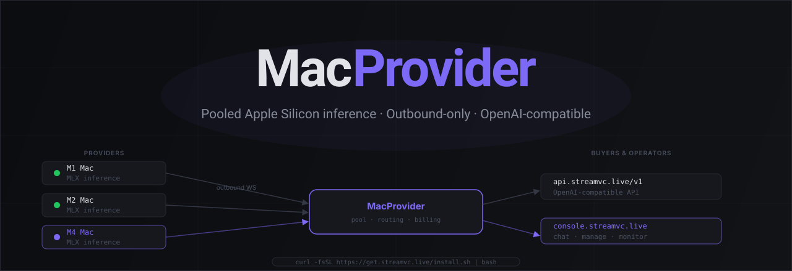

<p align="center">
  
</p>

<p align="center">
  <a href="https://console.streamvc.live"><strong>Console</strong></a> &middot;
  <a href="#for-providers"><strong>Join as Provider</strong></a> &middot;
  <a href="#for-buyers"><strong>API Access</strong></a> &middot;
  <a href="https://github.com/augustas11/macprovider/releases"><strong>Releases</strong></a>
</p>

<p align="center">
  
  
  
</p>

<br/>

# MacProvider

**Make any Apple Silicon Mac a remote-addressable MLX inference endpoint.** Built on `mlx-lm`. OpenAI-compatible API. Every response carries a signed receipt binding (prompt, output, provider) verifiable with the open-source [macprovider-verify](phase7-verify/README.md) CLI — verifiable inference, without a datacenter.

A lot of the most interesting LLM applications — long-running personal agents, privacy-sensitive tooling, dev workflows that hammer a model thousands of times a day — don't really belong in a cloud datacenter. But the moment you want your Mac's MLX endpoint to be reachable from somewhere that isn't localhost, you fall off a cliff: auth, tunneling, multi-tenant routing, observability, none of it exists out of the box. MacProvider is a thin layer over `mlx-lm` that fills that gap.

| For Providers | For Buyers |
|---|---|
| Run MLX models locally on any M1+ Mac | OpenAI-compatible `/v1/chat/completions` endpoint |
| Outbound WebSocket only — no port-forwarding needed | Route to the full pool or pin to a specific provider |
| Choose which models to serve from your Mac | Pay only for compute, no subscription required |
| Manage your node at [console.streamvc.live](https://console.streamvc.live) | Chat and monitor at [console.streamvc.live](https://console.streamvc.live) |

## Console

**[console.streamvc.live](https://console.streamvc.live)** is the front end for MacProvider. Today it ships two views:

- **Browser chat.** Send requests to the network directly from the browser, with session history.
- **Pool dashboard.** Monitor live provider pool status and which models are warm.

## Architecture

```
Provider Mac (MLX)
  └── outbound WS ──▶ MacProvider
                      (pool · routing · billing)
                             │
               ┌─────────────┴─────────────┐
               │                           │
    api.streamvc.live/v1          console.streamvc.live
    (OpenAI-compatible)               (web front end)
```

New public installs join as **provisional providers** over outbound WebSocket tunneling and can be promoted to pinned by the operator after observation. No inbound port-forwarding is required on the provider Mac.

**Trust model — what the coordinator sees:** prompts and responses pass through the gateway to enable routing and billing. Model weights stay on the provider Mac and never leave. Buyer prompts and provider responses are processed as plaintext on provider hardware — providers can technically observe prompts and outputs that route through their machine. This is acceptable for cooperative deployments where buyer and provider have an established trust relationship; it is NOT a private-inference guarantee. A self-hosted coordinator is on the roadmap for buyers who need local-only trust.

## For Providers

Run on any Apple Silicon Mac (M1 or newer, macOS 14+):

```bash
curl -fsSL https://get.streamvc.live/install.sh | bash
```

The installer:

- Picks a recommended MLX model based on available RAM (you can override)
- Asks for a stable provider handle used as your pool identity
- Downloads and verifies the latest `macprovider-cli` release against a signed checksum manifest
- Installs under `~/macprovider` and sets up a user-level launchd service
- Runs a local `/v1/models` check and a coordinator pool visibility check

**Security note:** `curl | bash` gives the downloaded script control of your user account. Inspect first if you prefer:

```bash
curl -fsSL https://get.streamvc.live/install.sh -o install.sh
less install.sh
bash install.sh
```

The binary is checksum-verified against a signed release manifest. macOS quarantine (`xattr`) is cleared with your approval during install. Developer ID signing and notarization are planned for a future release.

## For Buyers

Base URL: `https://api.streamvc.live`

The API is OpenAI-compatible — swap in your existing client:

```python
from openai import OpenAI

client = OpenAI(
    base_url="https://api.streamvc.live/v1",
    api_key="<your-api-key>",
)

response = client.chat.completions.create(
    model="mlx-community/Llama-3.2-3B-Instruct-4bit",
    messages=[{"role": "user", "content": "Hello"}],
)
print(response.choices[0].message.content)
```

Get an API key → [api.streamvc.live/auth/github/start](https://api.streamvc.live/auth/github/start)  
API reference → [api.streamvc.live/docs#api-reference](https://api.streamvc.live/docs#api-reference)

## Releases

Latest release and signed binaries: [github.com/augustas11/macprovider/releases](https://github.com/augustas11/macprovider/releases) (badge above auto-updates).

## Roadmap

:white_check_mark: **Signed inference receipts — Shipped in v1.0.0.** The SPEC-015 v0.2 verifier is available as the open-source [macprovider-verify](phase7-verify/README.md) CLI.

Every request through MacProvider carries a signed receipt that lets the caller later prove which provider signed the canonical prompt/output binding. The receipt is issued on the response path and signed with the provider's receipt key:

```json
{
  "model": "mlx-community/Llama-3.2-3B-Instruct-4bit",
  "prompt_hash": "sha256:7c3f...",
  "output_hash": "sha256:9b2a...",
  "provider_id": "m1-anon",
  "provider_pubkey": "ed25519:...",
  "ttft_ms": 646,
  "tokens_out": 142,
  "ts": "2026-06-04T12:34:56Z",
  "sig": "ed25519:..."
}
```

What this enables:

- **Audit trail.** A buyer can prove an inference happened, on which model, at which provider — without trusting the gateway to be honest after the fact.
- **Provider accountability.** Disputes over output quality or downtime become resolvable from receipts rather than from memory.
- **New compositions.** Receipts can be replayed into systems that don't trust the issuer but trust the signature (escrow, reputation, on-chain settlement).

The verifier contract is documented in [phase7-verify](phase7-verify/README.md). Feedback welcome via Issues.
