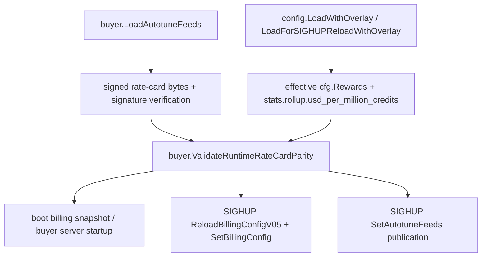

# Build 1 slice: runtime rate-card billing parity plan v1

Status: superseded by v2 after independent Sol plan-gate review found High/Medium issues around settlement alias semantics and SIGHUP retained-feed parity. Kept for audit history. Base was `7beeb8d8a5955eb225528cde53497326643e7d3a`. This is a coordinator-only Product Build 1 slice. It does not implement BYOM artifact preparation, publish an artifact-bound release, activate production admission, or prove the physical Mac preparation -> admission -> settled-request acceptance journey.

## 1. Reconciled implementation state

This plan was written after PR #1487 merged and BYOM PR #1481 was already merged. The roadmap source of truth remains `/private/tmp/macprovider-roadmap/.omx/plans/product-roadmap-422fc2f1.md`; it exists locally, but its commit baseline is historical and was rechecked against current `origin/main`.

| Build 1 requested outcome | Current classification | Evidence | Consequence |
| --- | --- | --- | --- |
| Signed artifact-feed production and distribution | Partial / pre-activation | `phase4-coordinator/internal/buyer/autotune_feeds.go` verifies the signed feed set and serves literal bytes; `phase4-coordinator/internal/buyer/catalog_artifacts_feed.go` serves `/v1/catalog-artifacts`; `docs/runbooks/catalog-artifact-feed-release.md` says the activation release still needs measured sizes, a new release id, and configured paths. | The coordinator can serve a valid release after operator activation, but today's default deployment does not prove artifact-feed availability. |
| CLI consumption of signed artifact feed | Partial | `phase3-binary/Sources/macprovider-cli/AutotuneArtifactFeed.swift` validates signer, release, freshness, and feed/catalog binding; current `AutotuneCatalog.generated.swift` bakes no artifact feed. | Provider UX cannot depend on a live artifact feed yet. |
| Durable trusted artifact preparation | Partial | `phase3-binary/Sources/macprovider-cli/DurableModelArtifactStore.swift` and autotune prefetch paths stage, hash, and adopt artifacts; `phase3-binary/Sources/macprovider-cli/ModelsSubcommand.swift` has no `models prepare` command, and `ModelCatalogEconomics.swift` leaves prepare actions unavailable. | Physical self-service prep remains a later Build 1 slice. |
| Authoritative model identity, pricing, settlement admission | Partial / guarded | `phase4-coordinator/internal/buyer/model_admission.go` and `internal/ws/model_admission_operator.go` route only signed catalog/release-bound settlement-capable rows; `phase4-coordinator/internal/buyer/rate_card.go` serves signed rate-card bytes if enabled and otherwise projects the current billing config. | Route-time admission is strict, but signed public prices can drift from effective billing if runtime overlays or SIGHUP modify `rewards.*` after the release-time parity check. |
| Correctly priced and settled request | Partial / not physically qualified | Billing snapshots use `cfg.Rewards`; `/v1/rate-card` can serve signed feed bytes; `docs/runbooks/catalog-artifact-feed-release.md` lines 381-388 state the release-time parity gate only sees committed `dist/coordinator.yaml`, while Pearl overlays can override `rewards.*`. | A signed rate-card release could truthfully verify yet disagree with runtime settlement economics. This must fail closed before activation. |
| Executable provider UX with truthful readiness/economics | Partial | `ModelCatalogEconomics.swift` suppresses trusted economics for fallback, stale, and non-settlement states; Malibu displays the projection. | UI remains truthful about unavailable prep, but cannot prove paid request settlement until authority/runtime parity is guarded. |

## 2. User journeys covered by this slice

1. Operator boots the coordinator with signed autotune feeds enabled and no overlay drift. Startup validates the signed feed set, validates signed rate-card bytes against the effective `rewards.rate_card`, `rewards.provider_share`, `rewards.global_multiplier`, and `stats.rollup.usd_per_million_credits`, then serves `/v1/rate-card` as the verified signed bytes and uses the same values for billing snapshots.
2. Operator boots the coordinator with signed feed bytes that disagree with the effective config after overlay merge. Startup fails before HTTP listeners bind, before a billing snapshot is inserted, and before any feed bytes can be served.
3. Operator sends SIGHUP with a new signed feed set and matching effective billing config. Reload validates all existing feed/catalog/tier/billing prerequisites and the new parity check, then atomically publishes both the feed bytes and billing config through the existing reload flow.
4. Operator sends SIGHUP where Pearl overlay or any reloadable config changes `rewards.*` or USD conversion away from the signed rate-card. Reload is rejected; the previous served feed bytes, billing config, settlement config, catalog, and admission state remain live.
5. Deployment without signed rate-card feeds continues to serve the generated fallback `/v1/rate-card` from effective billing config and is not blocked by this slice.

## 3. Ownership boundaries

- `phase4-coordinator/internal/buyer/` owns parsing signed feed bytes and the canonical in-process parity helper because `rate_card.go` already owns the rate-card projection and `autotune_feeds.go` already validates feed versions and signatures.
- `phase4-coordinator/cmd/coordinator/main.go` owns boot and SIGHUP enforcement, error/log messages, and preserving existing fail-closed publication order.
- `phase4-coordinator/internal/config/` remains unchanged unless tests need fixture helpers; it continues to parse effective base+overlay config before this parity check runs.
- `scripts/catalog-release.py` remains the release-time guard and must not be weakened. This slice adds runtime enforcement; it is not a replacement for the generator's parity check.
- Swift CLI/app, artifact preparation, Malibu UX, gateway listing, production deployment, and operator activation are explicit non-goals for this slice.

## 4. Dependency graph

Validation must happen after effective overlay merge and feed signature/schema validation, and before any path publishes signed rate-card bytes with billing config that could settle at a different price.

## 5. Normative contracts

1. When `AutotuneFeeds.rateCardEnabled()` is false, runtime parity is a no-op; the fallback rate card is derived from the live config and therefore remains self-consistent.
2. When the signed rate-card feed is enabled, every published row must match `buildRecommendationRateCardRows(effectiveRewards)` exactly, with no missing or extra normalized keys. The helper must use the same normalization semantics as `handleRateCard` fallback, including literal `default`, duplicate normalized rows, and prompt-cache-hit defaults.
3. Each signed row's `provider_share_bps` must equal `billing.ParseShareBps(effectiveRewards.ProviderShare)`, and each `global_multiplier_ppm` must equal `billing.ParseMultiplierPPM(effectiveRewards.GlobalMultiplier)`.
4. Signed feed `usd_per_million_credits` must equal the effective `cfg.Stats.Rollup.UsdPerMillionCredits` using the same JSON/projection representation that `recommendationRateCardVersion` consumes; a signed feed that would project a different version than the live fallback must be rejected.
5. The signed feed `version` has already been validated against its own rows by `validateRateCardFeed`; this slice must not reimplement signature validation or trust unsigned config text.
6. Boot rejection must occur before billing snapshot insertion, HTTP listener binding, and feed serving.
7. SIGHUP rejection must occur before `ReloadBillingConfigV05`, `SetBillingConfig`, `SetAutotuneFeeds`, or `SetAutotuneCatalog` publishes the new values. The incumbent runtime state must remain live.
8. Error messages and logs should name runtime rate-card parity and identify row/key/global/USD mismatch categories without printing secrets or operator credentials.

## 6. Phased implementation

1. Add a buyer-owned exported helper, tentatively `ValidateRuntimeRateCardParity(feeds AutotuneFeeds, rewards config.RewardsConfig, usdPerMillionCredits float64) error`.
   - Return nil when feeds lack a rate-card.
   - Parse the already-verified `feeds.RateCardJSON` into the closed rate-card feed type already used by `validateRateCardFeed` or an equivalent private struct.
   - Build expected rows using existing `buildRecommendationRateCardRows` and globals using `billing.ParseShareBps` and `billing.ParseMultiplierPPM`.
   - Compare row key sets, row rates, globals, and USD conversion; include stable mismatch text suitable for tests.
2. Call the helper on boot immediately after `buyer.LoadAutotuneFeeds(cfg.AutotuneFeeds)` and before candidate catalog parsing can proceed to network startup.
3. Call the helper inside `handleSIGHUP` after `LoadForSIGHUPReloadWithOverlay` and feed reload, using the same `cfg` that will later be applied to billing. Reject and return before tier2 config, billing snapshots, and feed publication.
4. Add unit tests in buyer for the helper:
   - no-feed no-op;
   - exact match succeeds;
   - missing/extra rows reject;
   - normalized alias drift rejects;
   - prompt, prompt-cache-hit, completion, share, multiplier, and USD drift reject;
   - signed feed bytes still go through existing signature/version validation tests.
5. Add coordinator-level tests if a testable seam exists without standing up the full daemon; otherwise add a focused test around a small reload helper or documented direct helper call. The acceptance proof must demonstrate boot/reload call sites are wired, not merely helper behavior.
6. Update `docs/runbooks/catalog-artifact-feed-release.md` to replace the current caveat with the new runtime guard: overlays can still override `rewards.*`, but a mismatch with signed feeds now fails boot/SIGHUP closed.
7. Run targeted Go tests, then the relevant coordinator package tests. Broader repo checks depend on changed surface and CI time.

## 7. Acceptance criteria and verification methods

| Criterion | Verification |
| --- | --- |
| Signed feeds plus matching effective config are accepted. | Unit test with constructed signed/feed-loaded fixture and effective rewards/USD matching the feed. |
| Signed feeds plus overlay-modified billing rows are rejected. | Test row mismatch after effective config construction; ideally a reload/boot seam test that proves rejection precedes publication. |
| Signed feeds plus global share, multiplier, or USD drift are rejected. | Unit tests covering each global. |
| Missing/extra normalized rate-card keys are rejected both ways. | Unit tests including literal `default` and normalized model alias cases. |
| SIGHUP does not publish mismatched feeds or billing config. | Coordinator reload test or seam test asserting previous `AutotuneFeedsForTest()` and `recommendationRateCardState()` remain unchanged after mismatch. |
| No-feed deployments keep existing fallback behavior. | Existing rate-card projection tests continue to pass plus a helper no-op test. |
| Runtime guard is documented for operators. | Runbook diff cites boot/SIGHUP fail-closed behavior and no longer leaves overlay parity as unguarded. |

## 8. Negative tests

- Tampered or unsigned feed: existing `LoadAutotuneFeeds` tests remain the signature/schema guard; this slice should not bypass them.
- Cross-release feed: existing feed release mismatch tests remain valid; parity helper only runs after load.
- Missing row in effective `rewards.rate_card`: reject with a missing-row category.
- Extra row in effective `rewards.rate_card`: reject with an extra-row category.
- Row rate drift: reject prompt, prompt-cache-hit, and completion differences.
- Global drift: reject provider share and global multiplier differences using billing rounding semantics.
- USD conversion drift: reject signed/public USD conversion that differs from effective stats rollup.
- SIGHUP mismatch: reject without applying new feed bytes or billing snapshot.
- No configured feed: no rejection and fallback `/v1/rate-card` remains generated from effective config.

## 9. Migrations and compatibility

No database migration, schema version change, API response change, signed-feed format change, or Swift compatibility change is planned. Operators with no configured signed rate-card feed see no behavior change. Operators enabling signed feeds must keep overlay-effective billing config in parity; mismatches become startup/reload failures instead of latent economics drift.

## 10. Rollback

Rollback is code rollback only. Removing this slice restores the prior risk where release-time parity does not account for runtime overlays. A safer operational rollback is to unset signed feed paths, causing `/v1/rate-card` to use the generated fallback projection from effective billing config until a matching signed release/config pair is deployed.

## 11. Observability

- Boot errors should print `runtime rate-card parity` with a stable mismatch category to stderr.
- SIGHUP rejection should log an error containing the same category and should retain the existing `autotune feed reload rejected` / billing reload rejection style.
- No new metrics are required for this slice, but a future production gate could count parity rejections if operator experience demands it.

## 12. Hardware and environment requirements

No physical Mac, MLX model, GPU, Docker runtime, production coordinator, or 64 GB+ machine is required for this slice. It protects the economics authority path before artifact-feed activation. Full Build 1 acceptance still requires a physical Mac completing preparation -> valid admission -> correctly settled request, and this slice does not satisfy that hardware qualification.

## 13. Explicit non-goals

- Do not generate, sign, publish, or activate a new artifact-bound release.
- Do not add `models prepare`, Malibu executable prep actions, or DurableModelArtifactStore UX.
- Do not broaden paid admission, settlement states, or model eligibility.
- Do not implement GGUF/non-primary serving-wire settlement.
- Do not change payout/reward activation, withdrawability, or production economic activation.
- Do not merge, deploy, or modify operator secrets.

## 14. Roadmap outcome mapping

| Roadmap outcome | This slice's contribution | Remaining work |
| --- | --- | --- |
| Provider obtains valid network admission and serves correctly priced/settled request | Ensures signed public rate card cannot disagree with settlement billing config at runtime. | Physical Mac admission/settlement e2e; artifact preparation UX; production qualification. |
| Authoritative pricing and settlement admission | Adds runtime parity to the already reviewed release-time parity and route-time settlement gates. | Feed activation and live overlay qualification. |
| Executable provider UX with truthful economics | Prevents future UI/API from showing signed prices that billing will not honor. | CLI/app preparation and readiness actions. |
| Corrupt/cross-release/stale artifacts fail closed | No direct change; existing feed validation remains. | Artifact preparation slice must test corrupt/cross-release/stale artifacts. |
| Unsupported/non-primary models do not get paid routing | No direct change; existing settlement preconditions remain. | Non-primary provider serving-wire identity slice if needed. |

## 15. Gate and review requirements

Before implementation, an independent GPT-5.6 Sol verifier must inspect this plan, the test spec, base revision `7beeb8d8a5955eb225528cde53497326643e7d3a`, and the referenced code. Implementation may start only after zero Critical, High, and Medium findings. After implementation, the complete diff must pass code, security, and architecture audit lanes with zero Critical/High/Medium findings, plus targeted tests and any broader checks justified by changed files.
