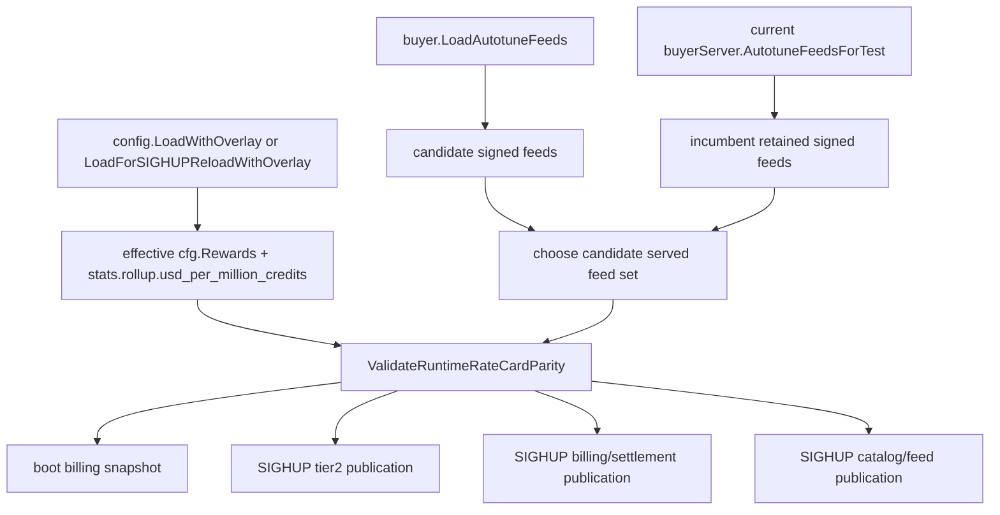

# Build 1 slice: runtime rate-card billing parity plan v2

Status: superseded by v3 after independent Sol plan-gate review found one Medium Tier-2 staging-order gap; kept for audit history. Was proposed for `codex/build1-next-slice` at base `7beeb8d8a5955eb225528cde53497326643e7d3a`. Supersedes v1 after independent GPT-5.6 Sol review rejected v1 with two High findings and one Medium finding. This revision resolves them by validating settlement lookup semantics, by checking the incumbent retained signed feed during SIGHUP when feed paths are cleared, and by requiring proof that parity rejection happens before tier2, billing, settlement, catalog, or feed publication side effects.

This is a coordinator-only Product Build 1 slice. It does not implement BYOM artifact preparation, publish an artifact-bound release, activate production admission, or prove the physical Mac preparation -> admission -> settled-request acceptance journey.

## 1. Reconciled implementation state

The roadmap source of truth exists at `/private/tmp/macprovider-roadmap/.omx/plans/product-roadmap-422fc2f1.md`; its baseline is historical, so this plan was reconciled against current `origin/main` after PR #1487 and BYOM PR #1481 had merged.

| Build 1 requested outcome | Current classification | Evidence | Consequence |
| --- | --- | --- | --- |
| Signed artifact-feed production and distribution | Partial / pre-activation | `phase4-coordinator/internal/buyer/autotune_feeds.go` verifies and serves literal signed feed bytes; `phase4-coordinator/internal/buyer/catalog_artifacts_feed.go` serves `/v1/catalog-artifacts`; `docs/runbooks/catalog-artifact-feed-release.md` still requires measured sizes, a new release id, and configured paths for activation. | Runtime can enforce feeds once configured, but today's default deployment does not prove artifact-feed availability. |
| CLI consumption of signed artifact feed | Partial | `phase3-binary/Sources/macprovider-cli/AutotuneArtifactFeed.swift` validates signer, release, freshness, and feed/catalog binding; current generated catalog bakes no artifact feed. | Provider UX cannot yet rely on live artifact-feed preparation. |
| Durable trusted artifact preparation | Partial | `DurableModelArtifactStore.swift` and autotune prefetch paths stage, hash, and adopt artifacts; `ModelsSubcommand.swift` has no `models prepare`; `ModelCatalogEconomics.swift` leaves prepare actions unavailable. | Self-service physical prep remains a later Build 1 slice. |
| Authoritative model identity, pricing, settlement admission | Partial / guarded | `internal/buyer/model_admission.go` and `internal/ws/model_admission_operator.go` guard settlement-capable routing; `/v1/rate-card` serves signed feed bytes when enabled, while billing snapshots use `cfg.Rewards`. `billing.RateFor` first uses an exact model key before normalized/default fallback. | Signed public price authority can drift from settlement economics through overlays/SIGHUP or exact-alias rate overrides unless runtime parity covers settlement lookup semantics. |
| Correctly priced and settled request | Partial / not physically qualified | Release-time parity in `scripts/catalog-release.py` compares generated feed to committed `dist/coordinator.yaml`; `docs/runbooks/catalog-artifact-feed-release.md` states overlays can override `rewards.*` at runtime. | A verified signed rate-card release can still disagree with effective runtime settlement config; this slice must fail closed. |
| Executable provider UX with truthful readiness/economics | Partial | Swift/Malibu projections suppress trusted economics for fallback/stale/non-settlement states. | UI truthfulness depends on backend not serving signed prices that settlement will not honor. |

## 2. User journeys covered by this slice

1. Operator boots with signed autotune feeds enabled and matching effective base+overlay config. Startup validates feed signatures/schema, then validates signed rate-card bytes against effective settlement rates, globals, and USD conversion before any billing snapshot or HTTP listener.
2. Operator boots with signed feed bytes that disagree with effective config after overlay merge. Startup fails closed before billing snapshot insertion, listener binding, catalog publication, or feed serving.
3. Operator sends SIGHUP with a new signed feed set and matching effective billing config. Reload validates the candidate served feed set and effective config before publishing tier2 state, billing config, settlement config, catalog, or feed bytes.
4. Operator sends SIGHUP with feed paths cleared while a live signed feed is already being served. Existing code retains the live feed/catalog and logs that disabling requires restart. This slice must validate the **incumbent live signed feed** against the new effective billing config before publishing any reloadable economics/admission state; mismatches reject and keep the previous runtime state.
5. Deployment without any signed rate-card feed remains unchanged: `/v1/rate-card` is generated from effective config, so runtime parity is a no-op.

## 3. Ownership boundaries

- `phase4-coordinator/internal/buyer/` owns the exported parity helper because `rate_card.go` owns public projection and `autotune_feeds.go` owns signed feed loading/validation.
- `phase4-coordinator/cmd/coordinator/main.go` owns boot and SIGHUP enforcement and must preserve fail-closed ordering.
- `phase4-coordinator/internal/billing/` settlement lookup semantics are authority for whether effective config can bill a model at a different rate than the signed/public row. This slice may call existing `billing.NormalizeModelKey` / `billing.RateFor` semantics but should avoid broad billing rewrites unless the plan gate is reopened.
- `scripts/catalog-release.py` remains the release-time guard; this slice adds runtime enforcement and must not weaken generator checks.
- Swift CLI/app, artifact preparation, gateway listings, deployment, operator activation, and payout/reward activation are non-goals.

## 4. Dependency graph

The candidate served feed set is the newly loaded feeds when SIGHUP actually reloads feeds; otherwise it is the incumbent live feed snapshot if signed feed bytes remain live.

## 5. Normative contracts

1. If the candidate served feed set has no signed rate card, parity returns nil and fallback `/v1/rate-card` remains config-derived.
2. If a signed rate card is or will remain served, validate both public projection parity and settlement lookup parity.
3. Public projection parity: signed rows must match `buildRecommendationRateCardRows(effectiveRewards)` key-for-key and field-for-field, including prompt, prompt-cache-hit, completion, `provider_share_bps`, `global_multiplier_ppm`, and USD conversion.
4. Settlement lookup parity: no effective `rewards.rate_card` key may cause `billing.RateFor(effectiveRewards.RateCard, servedModelKey)` to return rates different from the signed row that buyers see for that normalized model. To make this finite and testable, reject any non-default effective key whose `billing.NormalizeModelKey(key)` collides with another effective key or signed row key unless the complete effective `RateCardEntry` equals the canonical signed/effective projection entry for that normalized key. This closes exact-alias overrides that public projection would otherwise collapse.
5. Each signed row's globals must equal `billing.ParseShareBps(effectiveRewards.ProviderShare)` and `billing.ParseMultiplierPPM(effectiveRewards.GlobalMultiplier)`.
6. Signed feed `usd_per_million_credits` must equal effective `cfg.Stats.Rollup.UsdPerMillionCredits` under the same numeric projection semantics used by `recommendationRateCardVersion`; a differing signed/public USD conversion rejects.
7. Boot rejection must occur before billing snapshot insertion, HTTP listener binding, tier2/catalog/admission publication, and feed serving.
8. SIGHUP rejection must occur before `wsServer.SetTier2Config`, `buyerServer.SetTier2Config`, `ReloadBillingConfigV05`, `buyerServer.SetBillingConfig`, `billingStore.SetSettlementConfig`, `wsServer.SetAutotuneCatalog`, and `buyerServer.SetAutotuneFeeds`. Incumbent runtime state remains live.
9. Error/log messages must name `runtime rate-card parity` and identify mismatch category without printing secrets or operator credentials.

## 6. Phased implementation

1. Add buyer helper `ValidateRuntimeRateCardParity(feeds AutotuneFeeds, rewards config.RewardsConfig, usdPerMillionCredits float64) error`.
   - Nil/no-op when no signed rate card is enabled.
   - Parse signed `RateCardJSON` using the same closed feed struct/decoder expectations as `validateRateCardFeed` or a shared private decoder.
   - Compare public projection rows and globals.
   - Add settlement-alias collision checks using `billing.NormalizeModelKey`, exact/default semantics, and complete row equality; reject colliding exact aliases with different rates even if the public projection row matches.
2. Add a `cmd/coordinator` seam, tentatively `validateAutotuneRuntimeEconomics(feeds buyer.AutotuneFeeds, cfg config.Config) error`, and call it at boot immediately after `buyer.LoadAutotuneFeeds` and before catalog parsing or billing snapshot work.
3. In SIGHUP, compute the candidate served feed set before any side-effect publication:
   - if new feed paths produce `haveReloadedAutotune`, validate `reloadedAutotuneFeeds`;
   - else, if a live feed/catalog is retained because paths were cleared or unchanged, validate `buyerServer`'s current live feed snapshot against the new effective config;
   - else no signed feed parity is needed.
4. Place the SIGHUP validation before tier2 configuration publication and before billing snapshot/reload operations. Do not apply partial tier2/billing/settlement/catalog/feed state on mismatch.
5. Add helper tests, coordinator seam tests, and retained-feed SIGHUP/call-order tests from the v2 test spec.
6. Update `docs/runbooks/catalog-artifact-feed-release.md` to state overlays are now runtime guarded at boot/SIGHUP when signed feeds are served.
7. Run targeted tests, then coordinator package tests and broader checks justified by changed files.

## 7. Acceptance criteria and verification methods

| Criterion | Verification |
| --- | --- |
| Matching signed feeds and effective config are accepted. | Buyer helper test plus coordinator seam boot test. |
| Public row/global/USD drift rejects. | Buyer helper tests for missing/extra rows, prompt/cache/completion drift, share, multiplier, and USD drift. |
| Exact alias settlement override rejects. | Required test `TestRuntimeRateCardParityRejectsExactAliasOverrideDrift`, using a canonical signed row plus an exact effective alias with different settlement rates. |
| No-feed deployments remain unchanged. | Helper no-op test and existing rate-card projection tests. |
| Boot mismatch rejects before side effects. | Coordinator seam test plus source line-order evidence before billing snapshot/listener/catalog publication. |
| SIGHUP with new feeds rejects before all side effects. | Coordinator seam/call-order test covering tier2, billing, settlement, catalog, and feed publication ordering. |
| SIGHUP with paths cleared and incumbent feed retained rejects drift. | Required test for incumbent live feed snapshot vs new effective billing drift. |
| Operator caveat is updated. | Runbook diff no longer leaves overlay parity as unguarded. |

## 8. Negative tests

- Tampered/unsigned/cross-release feeds continue to fail in existing `LoadAutotuneFeeds` tests; parity helper must not bypass them.
- Missing signed row from effective config rejects.
- Extra effective row absent from signed config rejects, including normalized aliases.
- Exact served alias with different settlement rate rejects even if canonical projection row matches.
- Prompt, prompt-cache-hit, completion, share, multiplier, and USD drift reject.
- SIGHUP path-cleared/retained-live-feed drift rejects without changing previous runtime state.
- No signed feed no-ops.

## 9. Migrations and compatibility

No database migration, response schema change, signed-feed format change, or Swift compatibility change is planned. Configurations with duplicate normalized/exact aliases that would bill differently from the signed public row become invalid only when a signed rate-card feed is or remains served. No-feed deployments retain current behavior.

## 10. Rollback

Rollback is code rollback. Operationally, signed feed paths can be unset and coordinator restarted to return to generated fallback `/v1/rate-card` from effective config. SIGHUP path clearing does not disable a live signed feed in current code; disabling signed feeds still requires restart as existing logs state.

## 11. Observability

Boot stderr and SIGHUP logs should include `runtime rate-card parity` plus mismatch category: missing row, extra row, row rate, alias collision, provider share, multiplier, USD conversion, or malformed feed. Do not log secrets or credentials.

## 12. Hardware and environment requirements

No physical Mac, MLX model, GPU, Docker runtime, production coordinator, or 64 GB+ machine is required. Full Build 1 acceptance still requires physical Mac prep -> valid admission -> correctly settled request; this slice only protects the economics authority path.

## 13. Explicit non-goals

- No artifact-bound release generation, signing, publishing, or production activation.
- No `models prepare`, Malibu executable prep action, DurableModelArtifactStore UX, or physical Mac e2e.
- No broadening of paid admission or settlement states.
- No GGUF/non-primary serving-wire settlement implementation.
- No payout/reward activation, withdrawal enablement, spending, deployment, or operator secret changes.

## 14. Roadmap outcome mapping

| Roadmap outcome | This slice's contribution | Remaining work |
| --- | --- | --- |
| Correctly priced and settled request | Prevents signed public price authority from diverging from runtime settlement billing after overlays/SIGHUP or exact alias overrides. | Physical Mac settled-request e2e and production qualification. |
| Authoritative pricing and settlement admission | Adds runtime parity to release-time parity and route-time settlement gates. | Feed activation and live deployment qualification. |
| Executable provider UX with truthful economics | Ensures future UI/API signed economics are billable at the same rates. | CLI/app prep and readiness actions. |
| Corrupt/cross-release/stale artifacts fail closed | Leaves existing feed validation intact. | Artifact-prep slice must cover artifact-specific negatives. |
| Unsupported/non-primary models do not get paid routing | Leaves existing settlement preconditions intact. | Non-primary serving-wire identity remains separate. |

## 15. Gate and review requirements

Before implementation, an independent GPT-5.6 Sol verifier must inspect this v2 plan, the v2 test spec, base revision `7beeb8d8a5955eb225528cde53497326643e7d3a`, and referenced code. Implementation may start only after zero Critical, High, and Medium findings. After implementation, the complete diff must pass independent code, security, and architecture audit lanes with zero Critical/High/Medium findings.

## 16. v1 finding dispositions

- High 1, projection parity misses exact-alias settlement overrides: resolved by adding settlement lookup parity and exact-alias collision rejection.
- High 2, SIGHUP path-clearing retains incumbent signed feed while new billing can publish: resolved by validating the candidate served feed set, including incumbent live feeds when retained.
- Medium 1, tests did not prove rejection before all side effects: resolved by requiring coordinator seam tests/line-order proof before tier2, billing, settlement, catalog, and feed publication.
