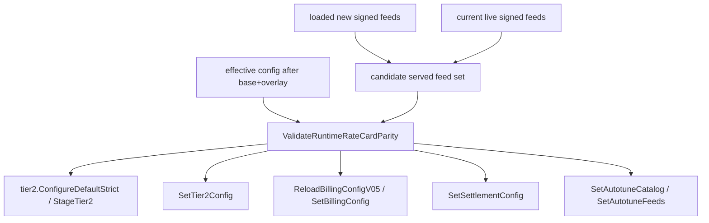

# Build 1 slice: runtime rate-card billing parity plan v3

Status: proposed for `codex/build1-next-slice` at base `7beeb8d8a5955eb225528cde53497326643e7d3a`. Supersedes v2 after independent GPT-5.6 Sol review found one Medium issue: SIGHUP parity had to run before Tier-2 staging, not only before visible publication calls. v3 keeps v2's alias and retained-feed corrections and adds a hard pre-`tier2.ConfigureDefaultStrict` / pre-`StageTier2` gate plus tests that no staged release material can survive a parity rejection.

This is a coordinator-only Product Build 1 slice. It does not implement BYOM artifact preparation, publish an artifact-bound release, activate production admission, or prove the physical Mac preparation -> admission -> settled-request acceptance journey.

## 1. Reconciled implementation state

The roadmap source of truth exists at `/private/tmp/macprovider-roadmap/.omx/plans/product-roadmap-422fc2f1.md`; its inspected baseline is historical, so this plan was reconciled against current `origin/main` after PR #1487 and BYOM PR #1481 had merged.

| Build 1 requested outcome | Current classification | Evidence | Consequence |
| --- | --- | --- | --- |
| Signed artifact-feed production and distribution | Partial / pre-activation | `phase4-coordinator/internal/buyer/autotune_feeds.go` verifies and serves signed feed bytes; `catalog_artifacts_feed.go` serves `/v1/catalog-artifacts`; `docs/runbooks/catalog-artifact-feed-release.md` still requires measured sizes, a new release id, and configured paths for activation. | Runtime enforcement is ready to guard a configured release, but default deployment does not prove feed availability. |
| CLI consumption of signed artifact feed | Partial | `AutotuneArtifactFeed.swift` validates signer, release, freshness, and feed/catalog binding; current generated catalog bakes no artifact feed. | Provider artifact prep UX remains a later slice. |
| Durable trusted artifact preparation | Partial | `DurableModelArtifactStore.swift` and autotune prefetch paths stage/hash/adopt; `ModelsSubcommand.swift` has no `models prepare`; `ModelCatalogEconomics.swift` leaves prepare actions unavailable. | Physical prep remains incomplete. |
| Authoritative model identity, pricing, settlement admission | Partial / guarded | Route-time settlement gates are in `internal/buyer/model_admission.go` and `internal/ws/model_admission_operator.go`; billing uses `cfg.Rewards`, while `/v1/rate-card` may serve signed bytes. `billing.RateFor` uses exact model keys before normalized/default fallback. | Runtime overlays, SIGHUP, or exact-alias overrides can create signed/public price drift unless guarded. |
| Correctly priced and settled request | Partial / not physically qualified | Release-time parity in `scripts/catalog-release.py` checks committed config; runbook notes overlays can override `rewards.*`; SIGHUP currently can stage Tier-2 material before named publication calls. | The coordinator must reject signed-feed/effective-config drift before any side effect, including Tier-2 staging. |
| Executable provider UX with truthful readiness/economics | Partial | Swift/Malibu suppress trusted economics for fallback/stale/non-settlement states. | UI/API truthfulness depends on backend not exposing signed rates billing will not honor. |

## 2. User journeys covered by this slice

1. Boot with signed feeds and matching effective base+overlay config: validate signatures/schema, then runtime rate-card/billing parity before billing snapshot, listener binding, or release/admission publication.
2. Boot with signed feed drift after overlay: fail closed before side effects.
3. SIGHUP with new signed feeds and matching effective config: validate candidate served feed set before any Tier-2 staging/publication, billing snapshot/reload, settlement change, catalog swap, or feed swap.
4. SIGHUP clearing feed paths while a live signed feed is retained: validate the incumbent live signed feed against the new effective config before any reload side effect; mismatch rejects and keeps the prior state.
5. No signed rate-card feed: parity no-ops and fallback `/v1/rate-card` remains generated from effective config.

## 3. Ownership boundaries

- `phase4-coordinator/internal/buyer/` owns `ValidateRuntimeRateCardParity` because it owns rate-card projection and signed feed loading.
- `phase4-coordinator/cmd/coordinator/main.go` owns boot/SIGHUP call ordering and the candidate-served-feed selector.
- `phase4-coordinator/internal/billing/` remains the settlement lookup authority; parity must account for `billing.RateFor` exact-before-normalized semantics.
- `phase4-coordinator/internal/tier2` and `internal/ws` staging mechanics are not rewritten; the coordinator call order must keep parity before `tier2.ConfigureDefaultStrict` can invoke release staging.
- `scripts/catalog-release.py` remains the release-time guard.
- Swift, gateway, deployment, payout/reward activation, and physical MLX e2e are non-goals.

## 4. Dependency graph

The parity gate must dominate every node to its right. A mismatch must leave no staged Tier-2 release material that `RefreshTier2HashStatuses` or a later reload can promote.

## 5. Normative contracts

1. No signed rate card in the candidate served feed set means no-op parity; fallback rate card remains config-derived.
2. Signed rate card present means validate both public projection parity and settlement lookup parity.
3. Public projection parity compares signed rows to `buildRecommendationRateCardRows(effectiveRewards)` key-for-key and field-for-field: prompt, prompt-cache-hit, completion, provider share bps, global multiplier ppm, and USD conversion.
4. Settlement lookup parity rejects exact-alias drift: any non-default effective key whose `billing.NormalizeModelKey(key)` collides with another effective key or signed row key must have the complete same effective `RateCardEntry` as the canonical signed/effective projection entry for that normalized key. Different exact-alias rates are invalid while a signed rate card is served.
5. Globals use `billing.ParseShareBps` and `billing.ParseMultiplierPPM`; USD uses the same numeric semantics as `recommendationRateCardVersion`.
6. Boot rejection occurs before billing snapshot insertion, HTTP listener binding, catalog/admission publication, feed serving, or any Tier-2 staging/publication.
7. SIGHUP rejection occurs before `tier2.ConfigureDefaultStrict`, any `StageTier2` or release-staging mutation, `wsServer.SetTier2Config`, `buyerServer.SetTier2Config`, `ReloadBillingConfigV05`, `buyerServer.SetBillingConfig`, `billingStore.SetSettlementConfig`, `wsServer.SetAutotuneCatalog`, `buyerServer.SetAutotuneFeeds`, and `RefreshTier2HashStatuses` publication of staged material.
8. On SIGHUP path clearing, the candidate served feed set is the incumbent live feed snapshot if live signed feed bytes/catalog remain retained; it is not an empty no-op.
9. Error/log messages include `runtime rate-card parity` and a stable mismatch category without secrets.

## 6. Phased implementation

1. Add `buyer.ValidateRuntimeRateCardParity(feeds AutotuneFeeds, rewards config.RewardsConfig, usdPerMillionCredits float64) error`.
   - Nil when `feeds.rateCardEnabled()` is false.
   - Decode the signed rate-card bytes using existing closed feed semantics or shared private decoder.
   - Compare public projection rows/globals/USD.
   - Compare settlement alias semantics and reject exact-alias override drift.
2. Add a side-effect-free coordinator helper, e.g. `validateAutotuneRuntimeEconomics(feeds buyer.AutotuneFeeds, cfg config.Config) error`.
3. Add a SIGHUP candidate selector that returns reloaded feeds when `haveReloadedAutotune` is true, otherwise current live buyer-server feeds when signed feeds remain retained, otherwise empty/no-op feeds.
4. In boot, call the coordinator helper immediately after `buyer.LoadAutotuneFeeds` and before candidate catalog parsing and all later startup side effects.
5. In SIGHUP, call the selector/helper after config load and any pure feed loading, but before `telemetryDriftEvaluatorForReload` only if practical and always before `tier2.ConfigureDefaultStrict`; if a prerequisite pure validation needs the effective catalog pointer, it must not mutate staged/published state before parity passes.
6. Add tests from the v3 test spec, including exact-alias override and no-staged-Tier-2-material rejection.
7. Update the artifact-feed runbook to state overlays/SIGHUP are runtime guarded whenever signed feeds are or remain served.
8. Run targeted and coordinator checks, then independent code/security/architecture audits after implementation.

## 7. Acceptance criteria and verification methods

| Criterion | Verification |
| --- | --- |
| Matching signed feed/effective config accepted. | Buyer helper and coordinator boot seam tests. |
| Row/global/USD drift rejected. | Buyer helper tests for row fields, missing/extra keys, share, multiplier, USD. |
| Exact-alias settlement override rejected. | `TestRuntimeRateCardParityRejectsExactAliasOverrideDrift`. |
| Boot mismatch rejects before side effects. | Coordinator seam test plus line-order proof before billing snapshot/listener/catalog/feed/Tier-2 staging. |
| SIGHUP new-feed mismatch rejects before staging/publication. | Test/line-order proof that validation precedes `tier2.ConfigureDefaultStrict` and all `Set*`/billing calls. |
| SIGHUP retained-live-feed drift rejects. | Test selector uses incumbent live feed and rejects billing drift. |
| No staged release material survives rejection. | Focused seam or fake stage hook test proves no `StageTier2` path runs, and acceptance report cites line ordering before `RefreshTier2HashStatuses`. |
| No signed feed remains no-op. | Helper/coordinator no-op tests and existing projection tests. |

## 8. Negative tests

- Tampered/unsigned/cross-release feeds still fail existing `LoadAutotuneFeeds` tests.
- Missing/extra signed/effective row rejects.
- Exact alias with different settlement rates rejects; identical alias either succeeds or is normalized away safely.
- Prompt, cache-hit, completion, share, multiplier, USD drift reject.
- SIGHUP path-cleared retained-feed drift rejects without tier2 staging, billing, settlement, catalog, or feed mutation.
- No signed feed no-ops.

## 9. Migrations and compatibility

No DB migration, API schema change, signed-feed format change, or Swift compatibility change. Configs with duplicate normalized/exact aliases that bill differently from signed public rows become invalid only when signed rate-card feeds are or remain served. Existing no-feed deployments retain behavior.

## 10. Rollback

Rollback is code rollback. Operationally, unset signed feed paths and restart to return to generated fallback rate cards. SIGHUP path clearing alone still does not disable retained signed feeds.

## 11. Observability

Boot stderr and SIGHUP logs include `runtime rate-card parity` and mismatch category: missing row, extra row, row rate, alias collision, provider share, multiplier, USD, malformed feed, or retained-feed drift. No secrets are logged.

## 12. Hardware and environment requirements

No physical Mac, MLX model, GPU, Docker runtime, production coordinator, or 64 GB+ machine is required. Full Build 1 hardware qualification remains blocked on physical Mac prep -> valid admission -> settled request.

## 13. Explicit non-goals

No artifact release activation, `models prepare`, Malibu prep action, DurableModelArtifactStore UX, paid-admission broadening, GGUF serving-wire settlement, payout/reward activation, deployment, spending, or operator secret changes.

## 14. Roadmap outcome mapping

| Roadmap outcome | This slice's contribution | Remaining work |
| --- | --- | --- |
| Correctly priced and settled request | Prevents signed public price authority from diverging from runtime settlement billing after overlays/SIGHUP/exact aliases. | Physical Mac settled-request e2e and production qualification. |
| Authoritative pricing and settlement admission | Adds runtime parity before admission/economics staging or publication. | Feed activation and live qualification. |
| Executable provider UX with truthful economics | Ensures future UI/API signed economics are billable at the same rates. | CLI/app prep and readiness actions. |
| Corrupt/cross-release/stale artifacts fail closed | Existing feed validation remains. | Artifact-prep slice covers artifact negatives. |
| Unsupported/non-primary models do not get paid routing | Existing settlement preconditions remain. | Non-primary serving-wire identity is separate. |

## 15. Gate and review requirements

Before implementation, independent GPT-5.6 Sol verification must report zero Critical/High/Medium findings on this v3 plan and v3 test spec. After implementation, complete diff must pass independent GPT-5.6 Sol code, security, and architecture audits with zero Critical/High/Medium findings.

## 16. Finding dispositions

- v1 High: projection parity missed exact-alias settlement overrides. Resolved by settlement lookup parity and exact-alias collision rejection.
- v1 High: SIGHUP could retain old signed feed while changing billing. Resolved by incumbent-live-feed candidate selection.
- v1 Medium: tests did not prove rejection before all side effects. Resolved by coordinator seam and call-order requirements.
- v2 Medium: Tier-2 staging could occur before named publication calls. Resolved by requiring parity before `tier2.ConfigureDefaultStrict` / `StageTier2` and testing no staged material survives rejection.
