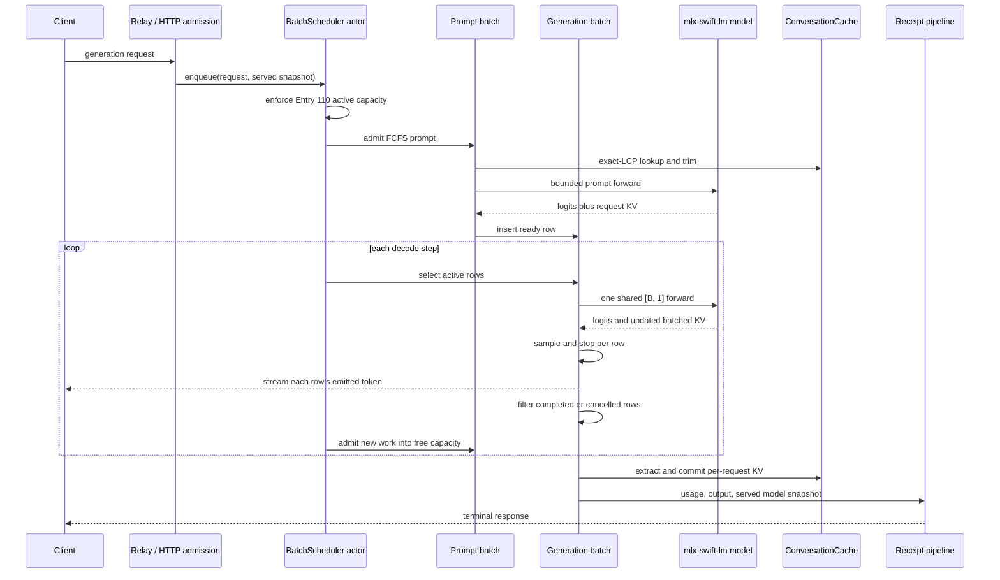

# RESEARCH_232 — Multi-stream / Continuous Batching on Apple Silicon for macprovider

| Field | Value |
|---|---|
| Status | Decision-grade research memo; no runtime changes |
| Memo date | 2026-07-22 |
| External landscape cutoff | 2026-07-09, with clearly labeled current notes through 2026-07-22 |
| Repository baseline | `origin/main`, verified 2026-07-22 |
| Engine baseline | `mlx-swift-lm` 3.31.4, revision `bd4b7434e6bdb588c7ef55706ff8904cb7fd4c57` |
| Related research | RESEARCH_223, RESEARCH_231, RESEARCH_233 |
| Recommended primary | **Approach A — contribute and harden an upstream `mlx-swift-lm` batch API** |
| Fallback | **Approach B — a narrow macprovider-owned native Swift batch scheduler** |
| Production no-go | Approach C sidecar and Approach D runtime swap |
| Decision horizon | Twelve months |
| Confidence | Medium-high on architecture; low-medium on throughput until MSB-01–05 are replicated |

## Executive summary

- macprovider currently supports **parallel single-stream decode**, not continuous batching: `maxBatch` sizes an `AsyncSemaphore`, and each permit runs an independent `TokenIterator`.
- Entry 110 already ships multiple parallel slots on capable machines: M-Max ≥48 GB gets 2, M-Ultra ≥96 GB gets 3, and M-Ultra ≥128 GB gets 4.
- The old mlx-swift 2.29.1 Metal command-buffer crash was a superseded v1 constraint; it is not evidence that current Apple Silicon concurrency is impossible.
- Python `mlx-lm` has source-verifiable continuous batching through `BatchGenerator`: active decode rows share one model forward and can join or leave dynamically.
- Python `BatchGenerator` uses dense, contiguous batch-aware KV caches; it is not vLLM-style PagedAttention and does not mandate a shared paged allocator.
- The exact macprovider dependency, `mlx-swift-lm` 3.31.4, has no public `BatchGenerator`, `GenerationBatch`, `PromptProcessingBatch`, or concrete batched KV-cache implementation.
- Open upstream Swift work, especially PR #263, demonstrates a feasible contiguous-cache port but remains unmerged and incomplete for quantized KV, speculative decoding, and some cache subclasses.
- The primary recommendation is **Approach A**: contribute, review, and pin an upstream Swift batch implementation behind a macprovider feature flag.
- The fallback is **Approach B** if upstream acceptance or API stabilization misses the Q3 2026 gate; keep the fallback close to upstream semantics rather than inventing a separate serving architecture.
- oMLX, vllm-mlx, Higgs, LM Studio, and llama.cpp provide useful reference designs, but every advertised throughput multiplier remains an **unreplicated vendor or maintainer hypothesis** on macprovider hardware and catalog models.
- SPEC-028 speculative decoding remains single-slot and mutually exclusive with batching in the first release; combined speculative continuous batching is deferred.
- **RESEARCH_233 reciprocal verdict: INDEPENDENT.** The recommended contiguous-cache scheduler does not require a paged allocator, so RESEARCH_232 and RESEARCH_233’s default opaque-record persistence track can proceed in parallel.

## Decision

Pursue **Approach A: an upstreamed `mlx-swift-lm` batch API**, with macprovider supplying implementation effort, review, model coverage, lifecycle tests, and production integration.

The target is not a passive wait for an unspecified upstream release.

The target is a controlled contribution based on the proven Python `BatchGenerator` architecture:

1. FCFS admission with bounded queues.
2. Separate prompt-processing and decode batches.
3. One shared forward for active decode rows.
4. Dense, contiguous, batch-aware KV caches.
5. Dynamic insertion and removal between decode steps.
6. Per-request sampling, stop, cancellation, usage, and receipt state.
7. Single-owner actor isolation around mutable generator state.
8. Explicit rejection of unsupported cache types or `kv_bits` modes.
9. A serial fallback path identical to today’s behavior.
10. Version pinning to a reviewed upstream tag or revision.

Adopt Approach B only if the upstream path misses a calendar or correctness gate.

Do not deploy Approach C or D as the production answer to RESEARCH_232.

Approach C remains valuable as a benchmark oracle.

Approach D remains valuable as an alternative-runtime comparison.

Neither is a transparent batching-only change for macprovider.

## Evidence classification

This memo distinguishes four evidence classes.

| Label | Meaning |
|---|---|
| **Verified — repository** | Confirmed against macprovider `origin/main` on 2026-07-22 |
| **Verified — upstream source** | Confirmed in a cited release, tag, revision, issue, PR, or source file |
| **Vendor/project claim — unreplicated** | Reported by a maintainer or vendor but not reproduced by macprovider |
| **Inference/recommendation** | Engineering judgment derived from the verified evidence |

No `d-inference` source was inspected.

That project remains outside the clean-room boundary.

---

# Part 1 — Landscape audit

## 1.1 macprovider’s current concurrency model

**Verified — repository.**

`ModelRuntime` declares an `AsyncSemaphore` named `inferenceGate`.

It initializes the semaphore with:

```swift
AsyncSemaphore(value: max(1, maxBatch))
```

The relevant initialization sites are in:

- `phase3-binary/Sources/MacProviderCore/ModelRuntime.swift:445`
- `phase3-binary/Sources/MacProviderCore/ModelRuntime.swift:559`

Generation, streaming generation, warm-up, and startup-throughput paths execute inside `inferenceGate.withPermit { … }`.

Each accepted request obtains its own iterator and per-conversation cache state.

The semaphore limits how many independent request loops may run concurrently.

It does not combine their tokens into a shared model call.

A repository-wide search under `phase3-binary/Sources/` finds no:

- `BatchGenerator`
- `GenerationBatch`
- continuous-batching scheduler
- paged-KV allocator
- block table used by model forwards

Therefore:

> macprovider currently performs parallel single-stream decode, not continuous batching.

With `maxBatch = 4`, four independent `TokenIterator` instances may be active.

They do not execute one shared `[4, 1]` decode forward.

This distinction is the central premise of this memo.

## 1.2 Current concurrency is not the superseded v1 state

An old `DECISION_CRITERIA` entry dated 2026-05-27 documented Metal command-buffer crashes under concurrent inference with mlx-swift 2.29.1.

That finding forced `max_concurrency = 1` for the v1 runtime.

It is historical evidence, not a current invariant.

The current engine is `mlx-swift-lm` 3.31.4.

Entry 110 now ships multiple parallel slots on qualifying hardware.

The accurate current statement is:

- Parallel decode is live.
- Multi-slot parallel decode is live on capable M-Max and M-Ultra machines.
- True shared-forward continuous batching is absent.
- Apple Silicon concurrency is not categorically impossible.
- The old crash should remain documented as a regression risk, not a platform prohibition.

## 1.3 Entry 110 is the live capacity policy

**Verified — repository.**

SPEC-023 `autotune --recommend` derives `max_concurrency_override` from detected chip class and RAM.

The emitted recommendation is persisted into serve configuration.

`--max-batch` consumes that value.

Heartbeat telemetry exposes the resulting capacity through `slots_total`.

The live mapping is:

| Detected hardware | Entry 110 recommendation | Current advertised `slots_total` |
|---|---:|---:|
| M-base | 1 | 1 |
| M-Pro | 1 | 1 |
| M-Max below 48 GB | 1 | 1 |
| M-Max at least 48 GB | 2 | 2 |
| M-Ultra below 96 GB | 1 | 1 |
| M-Ultra 96–127 GB | 3 | 3 |
| M-Ultra at least 128 GB | 4 | 4 |

The recommendation pipeline is the source of truth.

A future batch scheduler must consume this policy.

It must not synthesize new tiers locally.

## 1.4 Candidate-system summary

The table freezes the primary comparison at the 2026-07-09 research cutoff.

Later activity is shown only as a current note.

| System | License and maintainer | Binding | Verified batching model | Maturity and production posture | Release/activity |
|---|---|---|---|---|---|
| **mlx-lm `BatchGenerator`** | MIT; Apple `ml-explore` | Python/MLX | True continuous batching; shared decode forward; dynamic join/leave; separate prompt and decode batches; contiguous batched KV | Official reference primitive, but a library API rather than a hardened server contract | v0.31.3, 2026-04-22 |
| **oMLX** | Apache-2.0; `jundot` | Python/FastAPI over mlx-lm | Uses `BatchGenerator`; FCFS by default with optional priority; memory-aware admission | Young, active serving layer; useful reference, not macprovider-compatible by default | v0.4.4 at cutoff, 2026-06-16; current v0.5.3 on 2026-07-22 |
| **mlx-swift-lm** | MIT; Apple `ml-explore` | Swift/MLX | No released continuous-batch API in exact 3.31.4; single-request iterators only | Official macprovider engine; stable single-request surface | v3.31.4, 2026-06-30 |
| **vllm-mlx** | Apache-2.0; `waybarrios` | Python/MLX | Uses `BatchGenerator`; FCFS/priority; dynamic rows; block-managed cache reconstruction | Pre-1.0 and version-fragile; patches upstream internals | v0.4.0, 2026-06-28 |
| **Higgs / mlx-server** | MIT; `panbanda` | Rust using `mlx-rs` | Source-verifiable shared batched decode for supported model families | Young architectural reference; narrow community footprint | `higgs-v1.6.0`, 2026-06-21 |
| **MLX Omni Server** | MIT; `madroidmaq` | Python/MLX | Per-request `stream_generate`; no verified shared forward | Feature-rich API wrapper, not a continuous-batching reference | v0.5.3, 2026-05-09 |
| **mlx-openai-server** | MIT; `cubist38` | Python/MLX | No verified `BatchGenerator` path in v1.8.1 | Community API wrapper | v1.8.1, 2026-05-03 |
| **llama.cpp server** | MIT; `ggml-org` community | C/C++ with Metal | Mature continuous batching using one context and shared `llama_batch` across slots | Most mature alternative runtime; not an MLX-compatible drop-in | Rolling build stream |
| **LM Studio / mlx-engine** | App proprietary; engine MIT; LM Studio | Python/MLX engine | Open engine uses `BatchGenerator`; text and VLM batching shipped | Polished product; full control plane is closed | LM Studio 0.4.19 at cutoff; engine 1.8.5 |
| **Ollama** | MIT; Ollama | Go plus backend-specific runners | GGUF path inherits llama.cpp batching; native MLX runner serializes in inspected source | Mature distribution, but semantics vary by backend | Rapid release stream |

## 1.5 mlx-lm `BatchGenerator`

**Verified — upstream source.**

Python `mlx-lm` v0.31.3 includes `BatchGenerator`, `PromptProcessingBatch`, and `GenerationBatch`.

The most useful cutoff snapshot is the last reviewed `mlx-lm` revision before 2026-07-09:

`86e9b35ea4db2c1bbaa6914c5fea56549d3e0dbd`

The implementation maintains:

- a queue of unprocessed sequences;
- an active prompt-processing batch;
- an active generation batch;
- per-row samplers and logit processors;
- per-row stop matchers;
- per-row token histories;
- per-row cache extraction;
- dynamic insertion and removal.

The generation step invokes the model for all active decode rows together.

Conceptually:

```python
model(inputs[:, None], cache=prompt_cache)
```

where `inputs` contains one token per active sequence.

This is a shared forward pass.

It is not merely multiple Python generators executing concurrently.

Finished rows are filtered out.

Newly prefetched rows can be extended into the generation batch.

The default queue behavior is FCFS.

The implementation is decode-first.

Prompt work is admitted after the current decode step when capacity permits.

Prefill and decode are not mixed into one heterogeneous model call.

The cache layout is dense and contiguous.

It is not PagedAttention.

Primary sources:

- [mlx-lm v0.31.3 release](https://github.com/ml-explore/mlx-lm/releases/tag/v0.31.3)
- [BatchGenerator implementation at the reviewed cutoff revision](https://github.com/ml-explore/mlx-lm/blob/86e9b35ea4db2c1bbaa6914c5fea56549d3e0dbd/mlx_lm/generate.py)
- [mlx-lm cache implementations](https://github.com/ml-explore/mlx-lm/blob/86e9b35ea4db2c1bbaa6914c5fea56549d3e0dbd/mlx_lm/models/cache.py)

## 1.6 oMLX

**Verified — upstream source.**

oMLX is a Python serving layer over `mlx-lm`.

Its scheduler delegates continuous generation to `mlx_lm.generate.BatchGenerator`.

Its architecture includes:

- waiting queues;
- FCFS and optional priority policy;
- prompt and completion batch limits;
- cancellation;
- memory-aware admission;
- prefix-cache integration;
- model lifecycle controls;
- request-level streaming.

At the 2026-07-09 cutoff, the latest stable release was v0.4.4.

A later v0.5.3 release appeared on 2026-07-22.

This memo uses v0.4.4 for cutoff conclusions and treats later changes as current notes only.

oMLX uses “paged cache” terminology for block metadata, reusable prefix state, and storage tiers.

That must not be confused with a vLLM PagedAttention kernel.

The inspected architecture restores or assembles cache objects for consumption by `BatchGenerator`.

The model forward does not consume a vLLM-style block table.

**Vendor/project claim — unreplicated.**

oMLX reports up to **4.14× aggregate token-generation throughput at eight concurrent requests** for an M3 Ultra/Qwen3-Coder-Next-8bit test.

That number is aspirational for macprovider until reproduced with:

- the same model revision;
- macprovider catalog artifacts;
- fixed prompt and decode lengths;
- controlled cache reuse;
- controlled thermal state;
- aggregate wall-clock measurement;
- receipt and output parity.

The 4.14× figure is not used as a planning baseline.

Primary sources:

- [oMLX repository](https://github.com/jundot/omlx)
- [oMLX v0.4.4 release](https://github.com/jundot/omlx/releases/tag/v0.4.4)
- [oMLX scheduler](https://github.com/jundot/omlx/blob/v0.4.4/omlx/scheduler.py)
- [oMLX benchmark site](https://omlx.ai/)

## 1.7 mlx-swift-lm 3.31.4

**Verified — repository and upstream source.**

macprovider pins:

- package: `mlx-swift-lm`
- version: `3.31.4`
- revision: `bd4b7434e6bdb588c7ef55706ff8904cb7fd4c57`

The exact tag contains:

- `TokenIterator`
- `SpeculativeTokenIterator`
- `KVCache`
- `KVCacheSimple`
- `QuantizedKVCache`
- `RotatingKVCache`
- array and list cache compositions
- a `BatchPositionedKVCache` protocol seam

It does not expose:

- `BatchGenerator`
- `PromptProcessingBatch`
- `GenerationBatch`
- `BatchKVCache`
- `BatchRotatingKVCache`
- a scheduler actor
- batch-aware per-row sampler state
- public dynamic insert/remove operations
- a paged KV allocator
- a PagedAttention kernel

`BatchPositionedKVCache` is preparatory API surface.

It is not a concrete continuous-batching engine.

Primary sources:

- [mlx-swift-lm 3.31.4 release](https://github.com/ml-explore/mlx-swift-lm/releases/tag/3.31.4)
- [Exact pinned `Evaluate.swift`](https://github.com/ml-explore/mlx-swift-lm/blob/bd4b7434e6bdb588c7ef55706ff8904cb7fd4c57/Libraries/MLXLMCommon/Evaluate.swift)
- [Exact pinned `KVCache.swift`](https://github.com/ml-explore/mlx-swift-lm/blob/bd4b7434e6bdb588c7ef55706ff8904cb7fd4c57/Libraries/MLXLMCommon/KVCache.swift)
- [Exact pinned `RoPEApplication.swift`](https://github.com/ml-explore/mlx-swift-lm/blob/bd4b7434e6bdb588c7ef55706ff8904cb7fd4c57/Libraries/MLXLMCommon/RoPEApplication.swift)

## 1.8 vllm-mlx

**Verified — upstream source.**

vllm-mlx uses Python `mlx-lm` `BatchGenerator`.

Its scheduler supports:

- FCFS or priority ordering;
- dynamic request admission;
- configurable prompt and completion batch limits;
- chunked-prefill adaptations;
- cancellation;
- prefix-cache and block metadata;
- request-level streaming.

Its “paged KV” naming also requires qualification.

The inspected v0.4.0 code reconstructs cache objects from managed block records before inserting them into the upstream batch generator.

This does not establish a vLLM PagedAttention kernel.

The project also patches internal `BatchGenerator` behavior.

That creates version-coupling risk.

**Vendor/project claim — unreplicated.**

The project reports approximately 1.5×–3.39× throughput gains at five requests on selected models.

It reports approximately 2.38× for a Qwen3 30B-A3B model.

These are project-authored benchmarks.

They are hypotheses for MSB-04, not accepted macprovider capacity multipliers.

Primary sources:

- [vllm-mlx repository](https://github.com/waybarrios/vllm-mlx)
- [vllm-mlx v0.4.0 release](https://github.com/waybarrios/vllm-mlx/releases/tag/v0.4.0)
- [vllm-mlx continuous-batching guide](https://github.com/waybarrios/vllm-mlx/blob/v0.4.0/docs/guides/continuous-batching.md)
- [vllm-mlx scheduler](https://github.com/waybarrios/vllm-mlx/blob/v0.4.0/vllm_mlx/scheduler.py)

## 1.9 mlx-server and MLX Omni Server

The name “mlx-server” is ambiguous across community repositories.

### Higgs, formerly exposed as mlx-server

**Verified — upstream source.**

Higgs uses Rust and `mlx-rs`.

For supported transformer families, its batch loop:

1. collects the current token from active requests;
2. concatenates rows into a shared `[N, 1]` input;
3. invokes one batched forward;
4. samples each row independently;
5. removes completed requests.

Prefill remains a separate phase.

Unsupported architectures and cache modes may fall back or be rejected.

This is a useful independent reference for a Swift actor-owned batch loop.

It is not a conservative production dependency for macprovider.

**Vendor/project claim — unreplicated.**

Maintainer throughput figures for small Llama models are not transferable to macprovider catalog models.

Sources:

- [Higgs repository redirect](https://github.com/panbanda/mlx-server)
- [Higgs batched engine](https://github.com/panbanda/higgs/blob/higgs-v1.6.0/crates/higgs-engine/src/batch_engine.rs)
- [Higgs v1.6.0 release](https://github.com/panbanda/higgs/releases/tag/higgs-v1.6.0)

### MLX Omni Server

**Verified — upstream source.**

MLX Omni Server invokes per-request `mlx_lm.stream_generate`.

It maintains request-exclusive prompt-cache state for concurrency safety.

No tagged `BatchGenerator` path or shared forward was found in v0.5.3.

It is concurrent API serving around individual generators.

It is not evidence of continuous batching.

Sources:

- [MLX Omni Server repository](https://github.com/madroidmaq/mlx-omni-server)
- [Tagged MLX chat generator](https://github.com/madroidmaq/mlx-omni-server/blob/v0.5.3/src/mlx_omni_server/chat/mlx/chat_generator.py)
- [MLX Omni Server v0.5.3](https://github.com/madroidmaq/mlx-omni-server/releases/tag/v0.5.3)

## 1.10 llama.cpp

**Verified — upstream source and documentation.**

`llama-server` implements mature continuous batching.

The relevant controls include:

- `--parallel` for server slots;
- `--cont-batching`, enabled by default;
- `--batch-size` for logical prompt batching;
- `--ubatch-size` for physical microbatching.

The server maintains one model context and one logical batch across active client sequences.

Tokens from active slots are accumulated.

One `llama_decode` processes the assembled batch.

Sampling and completion remain per slot.

This is the clearest mature alternative-runtime reference in the landscape.

It is not a transparent replacement for mlx-swift-lm.

A production switch would change:

- model artifact format from MLX weights to GGUF;
- quantization implementation;
- tokenizer integration;
- model loading behavior;
- model identity and hashing;
- supported architecture matrix;
- numerical output;
- speculative-decoding behavior;
- warm-swap assumptions;
- operational debugging surface.

Sources:

- [llama.cpp server documentation](https://github.com/ggml-org/llama.cpp/blob/master/tools/server/README.md)
- [llama.cpp server development documentation](https://github.com/ggml-org/llama.cpp/blob/master/tools/server/README-dev.md)
- [llama.cpp continuous-batching discussion](https://github.com/ggml-org/llama.cpp/discussions/8175)

## 1.11 LM Studio

The LM Studio desktop application and complete control plane are proprietary.

The separately published `lmstudio-ai/mlx-engine` is MIT-licensed.

**Verified — upstream source.**

Its batched model kit uses Python `mlx-lm` `BatchGenerator`.

The engine manages:

- request admission;
- cancellation;
- active batch generation;
- result streaming;
- model-specific batch capability;
- worker-thread ownership.

Text continuous batching shipped with the 1.0 generation of its MLX engine.

Later releases added VLM batching.

Current open source rejects speculative decoding for batched MLX models.

That supports this memo’s decision to defer combined batching and SPEC-028.

**Vendor claim — unreplicated.**

LM Studio reports approximately 2.2× throughput for four parallel chats on an M3 Max and a selected Qwen model.

That is not a macprovider capacity input.

Sources:

- [LM Studio 0.4.2 changelog](https://lmstudio.ai/changelog/lmstudio-v0.4.2)
- [LM Studio MLX engine workload article](https://lmstudio.ai/blog/mlx-engine-agentic-workloads)
- [Open `mlx-engine` batched model kit](https://github.com/lmstudio-ai/mlx-engine/blob/main/mlx_engine/model_kit/batched_model_kit.py)

## 1.12 Ollama

**Verified — upstream source and official documentation.**

`OLLAMA_NUM_PARALLEL` specifies the maximum number of parallel requests per loaded model.

The default is one.

Ollama documents that context and memory consumption scale approximately with:

```text
NUM_PARALLEL × CONTEXT_LENGTH
```

Its behavior depends on the selected backend.

For ordinary GGUF models, Ollama inherits llama.cpp-style slot and batching behavior.

For the inspected native MLX runner, source comments state that requests are serialized and use a fixed slot identifier.

Therefore:

> `OLLAMA_NUM_PARALLEL` is not, by itself, evidence of native MLX continuous batching.

Some model architectures are also forced to one parallel request.

Sources:

- [Ollama concurrency FAQ](https://docs.ollama.com/faq#how-does-ollama-handle-concurrent-requests)
- [Ollama scheduler](https://github.com/ollama/ollama/blob/v0.32.1/server/sched.go)
- [Ollama native MLX pipeline](https://github.com/ollama/ollama/blob/v0.32.1/x/mlxrunner/pipeline.go)

## 1.13 Landscape conclusion

The strongest directly reusable architecture is Python `mlx-lm` `BatchGenerator`.

The strongest alternative-runtime implementation is llama.cpp.

The best macprovider path is not to import a full community server.

It is to close the released Swift API gap while preserving macprovider’s existing:

- model artifacts;
- receipts;
- model hashes;
- request relay;
- warm swap;
- conversation cache;
- coordinator protocol;
- autotune pipeline;
- SPEC-028 single-slot path.

---

# Part 2 — Technical deep dive

## 2.1 Scheduler requirements

A continuous-batching scheduler owns mutable state across all active requests.

At minimum it needs:

- a bounded waiting queue;
- a prompt-processing set;
- an active decode batch;
- per-request lifecycle state;
- cancellation markers;
- terminal result delivery;
- batch-capacity enforcement;
- cache insertion and extraction;
- fairness accounting;
- drain semantics;
- error fan-out rules.

### Recommended initial policy

Use FCFS admission.

Do not introduce paid priority, deadlines, or buyer-class scheduling in the first build.

FCFS is preferable because it:

- matches upstream `mlx-lm`;
- is deterministic;
- is easier to test;
- avoids economic-policy coupling;
- reduces starvation risk;
- does not alter coordinator contracts;
- permits later priority extension.

Within FCFS, apply decode-first scheduling.

A scheduler iteration should:

1. advance the current decode batch by one token;
2. apply per-row sampling and stop conditions;
3. emit completed or streamed tokens;
4. remove terminal rows;
5. process cancellation at a safe boundary;
6. admit prompt work if decode capacity remains;
7. prefill admitted prompts;
8. convert ready prompts into generation rows;
9. form the next decode batch.

A request joins the shared decode batch only after its prompt prefill completes.

A request leaves when it:

- reaches a stop sequence;
- reaches its output-token limit;
- is cancelled;
- encounters a request-local error;
- encounters an unrecoverable batch error.

Request-local failures should not terminate healthy rows when isolation is possible.

A model-forward failure affecting the entire batch may fail every participating request.

That policy must be explicit in the future BUILD_SPEC.

### Queue limits

Three quantities must remain distinct:

1. **Advertised slots** — coordinator-visible active capacity.
2. **Active batch rows** — requests currently consuming inference capacity.
3. **Waiting queue depth** — accepted work not yet in the active batch.

Queue depth is not capacity.

A scheduler with four active rows and twenty queued requests still has `slots_total = 4`.

It must not advertise 24 slots.

### Backpressure

Backpressure should occur before unbounded prompt payloads or relay state accumulate.

The first implementation should use a small bounded queue.

A reasonable benchmark default is:

```text
queue_limit = 2 × slots_total
```

That is an experiment parameter, not a recommended permanent policy.

The production value should be selected from:

- prompt-memory overhead;
- coordinator retry behavior;
- cancellation frequency;
- p95 wait time;
- relay reconnect behavior;
- acceptable rejection rate.

## 2.2 KV-cache layout

### Current macprovider layout

**Verified — repository.**

`ConversationCache` stores per-conversation `[KVCache]` layer state.

The current mechanism supports:

- model and `kvBits` identity;
- exact longest-common-prefix matching;
- trimming;
- continuation from matching history;
- commit after successful generation;
- same-conversation exclusion.

Each request owns its logical cache state.

There is no global KV page pool.

### Python batch layout

**Verified — upstream source.**

Python `BatchKVCache` uses dense tensors shaped conceptually as:

```text
[batch, heads, sequence, head_dim]
```

Rows are aligned to the longest cache length.

Padding and metadata allow rows with different histories to coexist.

Capacity grows in contiguous token increments.

Batch operations include:

- extend;
- filter completed rows;
- concatenate batch rows;
- extract a row back into standalone cache state.

This is a batch-aware contiguous representation.

It is not a shared block allocator.

### Contiguous batching

Advantages:

- closest match to upstream Python;
- smallest conceptual change from current Swift caches;
- easier per-request extraction;
- easier exact-LCP integration;
- compatible with RESEARCH_233 opaque-record serialization;
- smaller initial implementation surface;
- no custom attention kernel required.

Costs:

- padding to the longest active sequence;
- cache copies during insertion, filtering, or compaction;
- fragmentation expressed as wasted padded tensor space;
- RAM pressure for heterogeneous prompt lengths;
- potential materialization cost on conversation-cache restore;
- less efficient prefix sharing than a block pool.

### Paged KV

A true paged allocator would introduce:

- fixed-size KV blocks;
- per-request block tables;
- free-block management;
- reference counts;
- copy-on-write prefix sharing;
- attention kernels aware of logical-to-physical block mapping;
- eviction policy;
- fragmentation metrics;
- persistence encoding tied to page identity or content.

That is materially larger than a scheduler port.

Neither upstream Python `BatchGenerator` nor the examined Swift PR requires it.

The large Python paged-KV proposal, PR #610, closed without merge.

Therefore a paged allocator is not a prerequisite for the first batching experiment.

### Interaction with `kv_bits`

Quantized KV is not merely a storage flag.

Batch row operations must preserve:

- quantization group size;
- quantization start offset;
- scale and bias tensors;
- sequence offsets;
- row insertion and filtering;
- extraction into standalone per-conversation caches;
- trim semantics;
- numerical compatibility.

The Python `QuantizedKVCache` does not have parity with the ordinary contiguous batch-cache operations.

Open Python work routes or proposes quantized-cache cases separately.

The exact Swift 3.31.4 API also lacks a batch-aware quantized KV implementation.

The first batching prototype should therefore:

- declare its supported `kv_bits` modes explicitly;
- fail preflight for unsupported quantized KV;
- never silently disable configured KV quantization;
- never reinterpret a quantized conversation cache as ordinary KV;
- measure the RAM cost of unquantized batch rows.

Quantized-KV batching should be a separate promotion gate.

### Explicit reciprocal verdict with RESEARCH_233

> **RESEARCH_233 RECIPROCAL VERDICT — INDEPENDENT.** The recommended primary approach ports the upstream contiguous, per-request-extractable batch-cache design and does **not** mandate a shared paged-KV allocator. RESEARCH_233 Approach A may therefore serialize each current per-conversation `[KVCache]` state as an opaque, versioned record while RESEARCH_232 develops the batch scheduler; the two tracks proceed in **parallel**. If RESEARCH_233’s contiguous-restore experiment fails its §7.3 TTFT, materialization, RAM, or cache-subclass gate—or if the eventual upstream batch API becomes paged-only—then the relationship changes to **LAYOUT-BOUND**: RESEARCH_232’s shared block layout must land before the RESEARCH_233 SPEC, and persistence becomes a consumer of that layout. RESEARCH_233’s codec/version boundary is the intended seam for that pivot.

This verdict matches RESEARCH_233’s default sequence.

It does not invoke the §7.3 pivot today.

## 2.3 Prefill versus decode

Prefill and decode have different compute shapes.

Prefill processes many prompt tokens.

Decode normally processes one new token per active request.

A first scheduler should not attempt arbitrary mixed-phase batching in one model call.

Use separate phases:

- **prompt processing** for newly admitted requests;
- **generation batching** for active decode rows.

### Decode-only sharing

The lowest-risk useful target is shared decode.

The model receives one current token for every active row.

Benefits:

- stable tensor shape;
- simple per-row result mapping;
- direct parity with Python `GenerationBatch`;
- low scheduling complexity;
- clear aggregate-TG measurement.

### Prompt processing

Prefill should be chunked or bounded so a long prompt does not monopolize the device.

Relevant controls include:

- maximum prompt batch size;
- maximum prompt tokens per iteration;
- chunk size;
- number of prompt requests admitted beside active decode;
- memory guard.

The first implementation should prefer decode latency over maximum prefill throughput.

A long prompt must not block existing decode rows for an unbounded interval.

### Mixed-phase batching

A more advanced engine could combine:

- prompt chunks from new requests;
- one-token decode rows from active requests;
- shared attention metadata;
- heterogeneous positions.

That may improve utilization.

It also increases:

- mask complexity;
- cache metadata complexity;
- model-family compatibility risk;
- latency variance;
- failure-surface size.

Mixed-phase forwarding is not required for the first production gate.

## 2.4 Exact mlx-swift-lm gap analysis

The comparison must be pinned to the exact macprovider engine.

### Python primitives available

At the reviewed Python cutoff, `mlx-lm` provides:

| Python primitive | Purpose |
|---|---|
| `BatchGenerator` | Owns queue, prompt batches, decode batch, insertion, removal, iteration |
| `PromptProcessingBatch` | Processes padded or ragged prompt work and produces generation-ready state |
| `GenerationBatch` | Runs shared one-token decode forwards |
| `BatchKVCache` | Dense batch-aware ordinary KV cache |
| `BatchRotatingKVCache` | Dense batch-aware sliding-window cache |
| Batch response/state types | Preserve per-request results and statistics |
| Per-row samplers | Apply request-specific sampling inside one batch |
| Cache filter/extract operations | Remove rows and return standalone request cache |
| Dynamic admission | Add newly prefetched requests to an active generation batch |

### Released Swift 3.31.4 surface

| Swift 3.31.4 primitive | Status |
|---|---|
| `TokenIterator` | Present; single request |
| `SpeculativeTokenIterator` | Present; single request |
| Ordinary KV caches | Present |
| Quantized KV cache | Present for single-request flow |
| Rotating and composite caches | Present |
| `BatchPositionedKVCache` protocol | Present as a positioning seam |
| `BatchGenerator` | Absent |
| Prompt-processing batch | Absent |
| Generation batch | Absent |
| Concrete batch KV cache | Absent |
| Dynamic row insert/filter/extract | Absent as a complete public batch system |
| Batch scheduler actor | Absent |
| Paged allocator | Absent |
| Paged-attention kernel | Absent |
| Batched speculative iterator | Absent |

### Upstream issue and PR status

[mlx-swift-lm issue #42](https://github.com/ml-explore/mlx-swift-lm/issues/42) tracks batch-generation support.

Contributor benchmark numbers in that issue are unreplicated.

They establish interest, not production readiness.

PR #150 proposed a broad continuous-generation implementation and was closed in favor of smaller changes.

That should be read as scope decomposition, not proof that Swift batching is impossible.

PR #178 merged a common RoPE-call refactor.

PR #212 merged `BatchPositionedKVCache`-related groundwork.

[PR #263](https://github.com/ml-explore/mlx-swift-lm/pull/263) is the most relevant open implementation.

It adds a direct contiguous-cache architecture resembling Python:

- `BatchGenerator.swift`;
- `BatchKVCache.swift`;
- prompt-processing state;
- generation-batch state;
- row samplers;
- state-machine tests;
- documentation.

The PR is substantial and remains unmerged.

Review history identifies real integration concerns:

- single-driver ownership;
- Sendability and actor isolation;
- unsupported `CacheList` behavior;
- state-space and ragged-prompt support;
- scheduler-container integration;
- prompt-cache integration;
- API stabilization.

It does not complete:

- quantized-KV batching;
- speculative batching;
- all cache subclasses;
- macprovider receipt semantics;
- macprovider warm-swap drain behavior;
- Entry 110 capacity integration.

### Gap conclusion

The gap is not a missing one-line API call.

It is a missing released subsystem.

However, the upstream Python implementation and Swift PR #263 substantially reduce design uncertainty.

The remaining risk is implementation hardening and integration, not proof of concept.

## 2.5 SPEC-028 speculative-decoding interaction

**Verified — repository.**

SPEC-028 is implemented through shipped code.

The runtime supports:

- `--draft-model`;
- `--num-draft-tokens`;
- `CompiledDecode`;
- draft-model loading;
- canary and benchmark flows;
- heartbeat telemetry;
- a greedy-only v0.1 request gate.

Draft-enabled v0.1 providers force:

```text
effective_max_batch = 1
```

This applies even when Entry 110 would otherwise recommend multiple slots.

If the operator explicitly requests `max_concurrency_override > 1`, serve preflight fails with:

```text
draft_model_capacity_shortfall
```

The current reason is structural.

The draft model is a second resident model.

It consumes working-set headroom that multi-slot parallel decode would otherwise use.

Therefore SPEC-028 and current multi-slot decode are already mutually exclusive.

They are not merely incompatible with hypothetical continuous batching.

### Requirements for combined speculative continuous batching

Coexistence would require at least:

1. a batched draft-model forward across active requests;
2. separate batched KV state for the draft model;
3. separate batched KV state for the main model;
4. ragged proposed-token blocks;
5. a main-model verification forward over `[B, K+1]`-like work;
6. per-request acceptance lengths;
7. per-row rollback or cache trimming;
8. stop-sequence handling inside accepted blocks;
9. variable token emission per scheduler iteration;
10. safe row compaction only at valid cache boundaries;
11. cancellation during proposal or verification;
12. working-set budgeting for two models and two KV families per row;
13. new autotune measurements;
14. receipt and usage parity for accepted tokens only.

Acceptance divergence is the central control-flow problem.

One request may accept all draft tokens.

Another may reject the first.

A third may encounter a stop sequence within the accepted span.

The scheduler cannot advance every row identically.

### Decision for SPEC-028

The primary approach **keeps SPEC-028 intact but separate**.

Initial mode matrix:

| Draft model | Batch depth | Result |
|---|---:|---|
| Disabled | 1 | Existing single-stream path |
| Disabled | 2–4 where Entry 110 allows | New continuous-batch path |
| Enabled | 1 | Existing SPEC-028 path |
| Enabled | Greater than 1 | Preflight failure; unchanged |
| Enabled with speculative batching experiment | Future research/build only |

Combined speculative batching is deferred.

It is not silently disabled.

It is not included in the initial throughput multiplier.

## 2.6 Recommended scheduler sequence



## 2.7 Scheduler invariants

The future implementation must preserve these invariants:

- one terminal result per accepted request;
- no token attributed to the wrong request;
- no cross-request sampler state;
- no cross-request stop state;
- no cross-request conversation cache;
- no execution of old queued work after a warm swap;
- no receipt model hash from a different weight snapshot;
- no hidden batch-depth increase beyond persisted Entry 110 policy;
- no silent `kv_bits` downgrade;
- no silent speculative-decoding downgrade;
- cancellation observed at a bounded scheduler boundary;
- deterministic cleanup after a batch-level failure;
- bounded queue memory;
- standalone single-request fallback.

---

# Part 3 — Measured throughput hypotheses

## 3.1 Measurement contract

MSB-01–05 are future experiments.

This memo does not claim that their thresholds are already met.

Every run must record:

- machine identifier;
- chip and GPU-core count;
- physical RAM;
- macOS version;
- thermal state;
- power mode;
- exact model repository and revision;
- local artifact digest;
- tokenizer digest;
- quantization;
- `kv_bits`;
- prompt length after tokenization;
- requested decode length;
- actual decoded tokens;
- sampling configuration;
- draft-model state;
- cache-hit state;
- batch limits;
- queue limits;
- wall-clock start and end;
- TTFT;
- per-stream TPOT;
- aggregate TG;
- peak resident memory;
- request errors;
- output-parity result.

Aggregate token-generation throughput is:

```text
sum(decoded tokens across completed requests)
------------------------------------------------
wall time from first decode start to last decode end
```

It must not be calculated by summing per-request elapsed durations.

For overlapping requests, summed elapsed durations double-count wall time.

Warm-up runs are excluded.

Thermally throttled runs are retained as diagnostics but excluded from the primary median only under a predefined rule.

Every scenario should run at least twenty valid repetitions.

MSB-05 should use at least thirty paired repetitions.

## 3.2 Scenario table

| ID | Configuration | Primary metric | Concrete pass threshold | Expected hypothesis |
|---|---|---|---|---|
| **MSB-01** | 1 stream, Qwen3-32B 4-bit, M4 Max 64 GB, pp1024/tg256 | Single-stream TG tok/s | Stable baseline: ≥20 valid runs, CV ≤10%, zero correctness errors, peak RSS ≤85% RAM | 12–25 tok/s; planning range only |
| **MSB-02** | 4 concurrent identical prompts, unique conversations, same 32B model | Aggregate TG | **>1.5× MSB-01**, zero request loss, p95 per-stream TPOT ≤3× baseline | 1.5–2.5×; vendor 4.14× at 8-way is not assumed |
| **MSB-03** | 4 concurrent diverse prompts with heterogeneous lengths | Aggregate TG and short-request TTFT | **>1.2× MSB-01**, zero starvation, short-request p95 TTFT ≤2× its single-stream baseline | 1.2–2.0× |
| **MSB-04** | 2 streams, Qwen3-Coder-30B-A3B 4-bit MoE | Aggregate TG | **>1.3× single-stream MoE**, peak RSS ≤85% RAM, no OOM | 1.3–2.0× |
| **MSB-05** | Native `max_batch=2` versus pinned oMLX sidecar | Per-machine aggregate TG delta | Paired result with 95% bootstrap CI width ≤0.20 and zero request-count mismatch; prototype promotion additionally requires ≥0.80× sidecar and ≥1.3× native single-stream | Native parallel 1.0–1.5×; sidecar 1.3–2.3× |

## 3.3 MSB-01 — single-stream control

### Hardware

- Apple M4 Max
- 64 GB unified memory
- performance power mode where available
- AC power
- no unrelated GPU workload

### Model

Use the exact catalog revision corresponding to:

```text
mlx-community/Qwen3-32B-4bit
```

If the catalog uses a different 32B 4-bit artifact, record the actual model and hash.

Do not substitute models between scenarios.

### Workload

- prompt tokens: 1,024
- requested decode tokens: 256
- temperature: 0
- top-p: disabled or deterministic default
- seed: fixed where meaningful
- draft model: disabled
- prefix reuse: disabled
- conversation cache: cold for measured prompt
- batch depth: 1
- queue depth: 0

### Pass threshold

MSB-01 is a baseline rather than an uplift test.

It passes when:

- at least twenty repetitions complete;
- zero output-correctness failures occur;
- no request terminates early;
- TG coefficient of variation is at most 10%;
- peak RSS remains at or below 85% of physical RAM;
- no Metal command-buffer failure occurs;
- median and p95 TTFT/TG are reported.

### Expected range

The expected 12–25 tok/s range is a planning hypothesis.

It is not derived from a reproduced macprovider result in this memo.

The observed baseline supersedes it.

## 3.4 MSB-02 — identical concurrent prompts

Use four simultaneous requests.

Each request uses the same tokenized prompt but a distinct conversation identity.

This prevents exact-LCP or shared conversation-cache reuse from contaminating the result.

### Workload

- prompt tokens per request: 1,024
- decode tokens per request: 256
- concurrent start barrier: required
- active batch target: 4
- sampling: deterministic
- draft model: disabled
- `kv_bits`: identical to MSB-01
- prefix cache: disabled
- request priority: equal

### Pass threshold

- aggregate TG greater than 1.5× MSB-01;
- four terminal responses for four accepted requests;
- zero token-to-request attribution failures;
- p95 per-stream TPOT at most 3× MSB-01;
- no starvation;
- no Metal failure;
- peak RSS at or below 85% RAM.

### Expected range

Expected aggregate gain: 1.5–2.5×.

oMLX’s reported 4.14× at eight-way concurrency is an unreplicated vendor hypothesis.

It is neither the expected median nor the pass threshold.

## 3.5 MSB-03 — diverse concurrent prompts

This scenario exercises ragged histories and scheduler fairness.

Use four unrelated prompts with token lengths:

- 512
- 1,024
- 1,536
- 2,048

Each request decodes 256 tokens.

Prompts must not share a reusable prefix.

### Pass threshold

- aggregate TG greater than 1.2× MSB-01;
- all four requests complete;
- no request waits indefinitely behind the longest prompt;
- the 512-token request’s p95 TTFT is at most 2× its single-request baseline;
- no cross-request output contamination;
- peak RSS at or below 85% RAM;
- zero scheduler deadlocks.

### Expected range

Expected aggregate gain: 1.2–2.0×.

This is intentionally below MSB-02.

Padding and prefill imbalance should reduce efficiency.

A system that excels only on identical prompts does not pass the practical batching gate.

## 3.6 MSB-04 — two-stream MoE

### Hardware

Use M4 Max 64 GB if the model fits within the 85% peak-RSS bound.

Otherwise repeat on the smallest Entry 110-eligible M-Ultra and record the deviation.

### Model

Use the exact catalog revision corresponding to:

```text
mlx-community/Qwen3-Coder-30B-A3B-Instruct-4bit
```

### Workload

- two concurrent requests;
- distinct 1,024-token prompts;
- 256 decode tokens each;
- deterministic sampling;
- draft model disabled;
- no prefix reuse;
- batch target 2.

### Pass threshold

- aggregate TG greater than 1.3× the same model’s single-stream result;
- no OOM or swap storm;
- peak RSS at or below 85% RAM;
- each stream sustains at least 45% of single-stream TG;
- outputs match the accepted deterministic tolerance.

### Expected range

Expected aggregate gain: 1.3–2.0×.

vllm-mlx’s approximately 2.38× five-request result for a related 30B-A3B model is an unreplicated project claim.

It is an upper comparison point, not a pass requirement.

## 3.7 MSB-05 — current native parallelism versus oMLX oracle

This scenario distinguishes two questions:

1. How much aggregate throughput does current parallel single-stream Swift decode obtain?
2. How much additional gain is available from a known shared-forward implementation?

### Compared systems

**Native arm**

- current macprovider runtime;
- `max_batch = 2`;
- two independent `TokenIterator` instances;
- exact pinned mlx-swift-lm 3.31.4.

**Reference arm**

- pinned oMLX v0.4.4;
- its exact dependency lock;
- `BatchGenerator`;
- equivalent batch depth 2.

The oMLX arm is a benchmark oracle only.

It is not a production integration prototype.

### Workload

Use the same model artifact where technically possible.

If Python and Swift loaders produce distinct transformed artifacts, record both digests and classify the comparison as approximate.

Use:

- two simultaneous 1,024-token prompts;
- 256 decode tokens;
- no prefix reuse;
- deterministic sampling;
- draft model disabled;
- thirty paired runs;
- randomized arm order.

### Measurement pass

The benchmark itself passes when:

- both arms produce the same accepted request count;
- zero measurement harness failures occur;
- the native/sidecar aggregate-TG ratio has a 95% bootstrap confidence-interval width no greater than 0.20;
- TTFT, TPOT, aggregate TG, and peak RSS are all reported;
- any output divergence is classified.

### Future prototype promotion threshold

An Approach A prototype should reach:

- at least 0.80× the reference sidecar’s aggregate TG;
- at least 1.3× native single-stream TG;
- receipt and model-identity parity;
- no additional correctness failure.

A lower result triggers profiling, not automatic cancellation.

It becomes a no-go if the gap is dominated by unavoidable Swift API limitations rather than fixable implementation overhead.

## 3.8 Benchmark interpretation rules

Do not compare:

- cached prompts against uncached prompts;
- draft-enabled runs against draft-disabled runs;
- different model revisions;
- different `kv_bits` modes;
- aggregate machine TG against per-stream TG;
- summed request durations against common-wall-clock duration;
- M3 Ultra vendor results against M4 Max capacity policy;
- eight-way vendor results against Entry 110 four-slot maximum.

Report both throughput and tail latency.

A scheduler that raises aggregate TG while producing unacceptable TTFT or starvation does not pass.

---

# Part 4 — Approach evaluation and recommendation

## 4.1 Estimation definitions

Engineer-month estimates include:

- implementation;
- upstream coordination where applicable;
- integration;
- tests;
- benchmark harness work;
- rollout controls;
- documentation;
- one review/fix cycle.

They exclude:

- broad model-catalog expansion;
- combined speculative batching;
- paged KV;
- RESEARCH_233 persistence implementation;
- buyer pricing changes.

Risk percentage means:

> estimated probability that the approach fails to reach the production gates within twelve months.

It is not the probability of a crash per request.

Throughput multipliers are expected per-machine aggregate TG relative to one native single stream.

They are hypotheses until MSB-01–05 run.

## 4.2 Comparative table

| ID | Approach | Engineer-months | Expected TG multiplier | 12-month risk | Receipts | `model_hash` | Warm swap | SPEC-028 | Entry 110 |
|---|---|---:|---:|---:|---|---|---|---|---|
| **A** | Upstream mlx-swift-lm batch API | **4–7** | **1.3–2.2×** on validated 2–4-slot hardware | **35%** | Preserve per request | Preserve current served snapshot | Extend drain to scheduler queue and rows | Keep single-slot; coexistence deferred | Directly compatible |
| **B** | Native Swift scheduler in macprovider | **6–10** | **1.2–2.1×** | **50%** | Preserve, but macprovider owns all correctness | Preserve if built around current runtime | More custom drain state | Keep single-slot; coexistence deferred | Directly compatible |
| **C** | Out-of-process oMLX/mlx-lm sidecar | **4–7** | **1.4–2.5× hypothesis** | **60%** | Requires trusted per-request bridge | Artifact and process identity mismatch risk | Two-process coordination | Separate implementation; current SPEC-028 not reusable | Mapping possible but semantics diverge |
| **D** | llama.cpp parallel runtime | **8–14** | **1.2–2.0× hypothesis** | **70%** | Requires runtime parity rebuild | GGUF creates new identity domain | New loader and swap lifecycle | SPEC-028 implementation not reusable | Requires separate calibration |

## 4.3 Approach A — upstream mlx-swift-lm batch API

### Scope

Contribute to or harden upstream batch-generation work.

Pin macprovider to a reviewed release or revision after:

- API review;
- model coverage;
- concurrency ownership review;
- cache correctness tests;
- failure tests;
- performance replication.

### Why it is primary

It preserves the current trust and artifact boundary.

The model remains loaded in the same Swift process.

Existing per-request semantics remain locally enforceable.

The design can follow upstream Python behavior.

Open PR #263 provides a concrete starting point.

The approach avoids maintaining an entire private inference engine.

### Expected implementation

The macprovider-owned work would include:

- upstream code contribution or review;
- actor isolation around the generator;
- request adapters;
- conversation-cache extraction and insertion;
- bounded admission;
- receipt snapshots;
- warm-swap drain;
- cancellation;
- metrics;
- Entry 110 enforcement;
- autotune concurrency probes;
- unsupported-cache preflight;
- fallback to serial iteration.

### Receipt impact

Low if per-request state remains first-class.

The scheduler must retain:

- request identity;
- input token count;
- output token count;
- terminal status;
- served model snapshot;
- output bytes or tokens used by receipt construction.

No batch identifier is required in the locked receipt tuple.

Batch telemetry belongs outside the receipt.

### `model_hash` impact

None by design.

The model hash remains derived from the served artifact and current identity rules.

All requests admitted before a swap must retain their served snapshot.

No queued request may be executed against different weights while retaining an old hash.

### Warm-swap impact

Moderate.

Drain logic must include:

- active decode rows;
- active prompt rows;
- accepted queued requests;
- cache commits;
- terminal receipt work.

The cleanest rule is:

> once draining begins, reject new admission and finish or cancel every request already bound to the old served snapshot before swapping weights.

### SPEC-028 impact

SPEC-028 remains on the current single-slot path.

No initial batched speculative decode.

### Entry 110 impact

Directly compatible.

The persisted recommendation caps active batch rows.

The scheduler does not create new hardware tiers.

### Risk

Estimated 35%.

Main risks:

- upstream API churn;
- PR #263 not merging;
- unsupported cache subclasses;
- Swift concurrency ownership;
- memory growth from padded contiguous KV;
- insufficient throughput at depth 2–4;
- quantized-KV gap.

## 4.4 Approach B — native Swift scheduler in `ModelRuntime`

### Scope

Implement a macprovider-owned scheduler over existing or minimally copied Swift APIs.

### Advantages

- full delivery control;
- no dependency on upstream merge timing;
- exact integration with receipts and warm swap;
- narrow catalog targeting;
- faster response to production failures.

### Disadvantages

- macprovider owns batch-cache correctness;
- greater divergence from upstream;
- recurring merge burden;
- model-family compatibility risk;
- more difficult long-term maintenance;
- temptation to expose private MLX behavior.

### Proper fallback shape

If activated, Approach B should remain a narrow port.

It should reuse upstream naming and semantics where licensing and APIs permit.

It should avoid:

- a proprietary paged allocator;
- a new attention kernel;
- priority economics;
- combined speculative batching;
- arbitrary mixed-phase scheduling.

### Risk

Estimated 50%.

The implementation is feasible.

The higher risk comes from long-term ownership and cache-model breadth.

## 4.5 Approach C — out-of-process sidecar

### Scope

Run oMLX or a pinned Python `mlx-lm` server beside macprovider.

Add an HTTP or local-socket adapter implementing `ModelRuntimeServing`.

### Advantages

- fastest access to proven `BatchGenerator`;
- strong benchmark oracle;
- independent process isolation;
- faster architectural experimentation;
- avoids waiting for Swift API parity.

### Attestation and identity blockers

A sidecar changes the trusted execution boundary.

Production adoption would need answers for:

- who verifies the sidecar binary and Python environment;
- how the exact dependency graph is attested;
- how model artifacts are addressed across processes;
- how the sidecar proves which weights served a request;
- how cancellation is made atomic;
- how token usage is trusted;
- how streamed output is bound to the receipt;
- how crashes are reconciled;
- how coordinator health reflects partial process failure;
- how warm swap spans two runtimes;
- how secrets and local sockets are protected;
- how duplicate execution is prevented after reconnect;
- how process upgrades affect deterministic behavior.

### Receipt impact

High.

The trusted macprovider process would be constructing receipts from remote process claims unless it independently verifies generation state.

That is not acceptable without a new attestation design.

### `model_hash` impact

High.

A path string or requested model name is not proof of the resident model artifact.

### Warm-swap impact

High.

Two processes must coordinate drain, unload, load, health, and atomic publication.

### SPEC-028 impact

Current Swift SPEC-028 cannot be reused.

A Python-side speculative implementation would constitute a separate runtime behavior.

### Decision

**Production no-go for RESEARCH_232.**

Permitted use:

- MSB-05 oracle;
- API-behavior comparison;
- profiler reference;
- failure-mode study.

The explicit non-goal remains intact: macprovider should not adopt oMLX as its inference engine.

## 4.6 Approach D — llama.cpp parallel runtime

### Scope

Add or replace the MLX runtime with llama.cpp server or embedded library support.

### Advantages

- mature continuous batching;
- mature slot management;
- broad operational history;
- Metal support;
- explicit batching controls;
- established server metrics.

### Costs

This is not a scheduler change.

It is a second inference stack.

It requires:

- GGUF artifacts;
- new catalog qualification;
- tokenizer parity checks;
- quantization comparison;
- new model hashes;
- new build and release provenance;
- new memory calibration;
- new warm-swap behavior;
- new output-drift baselines;
- new speculative-decoding integration;
- new error taxonomy;
- duplicate operational expertise.

### Decision

**No-go as the RESEARCH_232 production approach.**

It remains a valid comparative benchmark.

A separate research decision could evaluate llama.cpp as a full runtime strategy.

That decision should not be smuggled into a batching BUILD_SPEC.

## 4.7 Primary, fallback, and no-go statement

### Primary

**Approach A — actively contribute and harden an upstream `mlx-swift-lm` batch API.**

### Fallback

**Approach B — implement a narrow macprovider-owned Swift scheduler if the upstream calendar or API-stability gate fails.**

### No-go

- **Approach C** for production serving under the current receipt and attestation model.
- **Approach D** as a batching-only change.
- A custom paged-attention kernel in the first implementation.
- Combined SPEC-028 and continuous batching in the first implementation.
- Advertising higher capacity than Entry 110 recommends.
- Enabling unsupported `kv_bits` modes by silently changing cache policy.

## 4.8 Entry 110 compatibility

The scheduler’s active-row cap must map exactly to the persisted recommendation.

| Hardware class | Persisted `max_concurrency_override` | Maximum active batch rows | Advertised `slots_total` |
|---|---:|---:|---:|
| M-base | 1 | 1 | 1 |
| M-Pro | 1 | 1 | 1 |
| M-Max below 48 GB | 1 | 1 | 1 |
| M-Max at least 48 GB | 2 | 2 | 2 |
| M-Ultra below 96 GB | 1 | 1 | 1 |
| M-Ultra 96–127 GB | 3 | 3 | 3 |
| M-Ultra at least 128 GB | 4 | 4 | 4 |

A future scheduler may have separate internal limits for:

- prompt-processing batch size;
- generation batch size;
- physical microbatch size;
- queue depth.

None of those independently changes `slots_total`.

The safe first mapping is:

```text
slots_total = validated persisted Entry 110 concurrency
active generation rows ≤ slots_total
active accepted inference work ≤ slots_total
waiting queue reported separately
```

`slots_free` must be derived from validated active capacity minus active accepted/runnable work.

Queued work must not inflate total capacity.

## 4.9 Go/no-go gates

### Gate A0 — API viability

Go when:

- upstream batch API has a reviewable ownership model;
- per-row insertion, filtering, and extraction are supported;
- unsupported cache subclasses fail explicitly;
- the chosen revision can be pinned.

No-go when mutable batch state requires unsafe multi-owner access that cannot be contained by a Swift actor.

### Gate A1 — correctness

Go when:

- deterministic output matches the single-request path within the accepted tolerance;
- request identities never cross;
- cancellation and stops are per row;
- conversation-cache continuation remains correct;
- receipt fields remain unchanged.

No-go on any cross-request state leak.

### Gate A2 — performance

Go when:

- MSB-02 exceeds 1.5× MSB-01;
- MSB-03 exceeds 1.2× MSB-01;
- at least one Entry 110 multi-slot tier exceeds 1.3× aggregate TG;
- memory remains within the defined bound.

Pivot or stop if shared forwarding cannot outperform current parallel decode after profiling.

### Gate A3 — lifecycle

Go when:

- warm swap drains correctly;
- relay reconnect cannot duplicate work;
- model hash stays bound to the served snapshot;
- batch-level failure cleanup is deterministic.

### Gate A4 — upstream calendar

If no acceptable upstream merge, stable branch, or pin-ready revision exists by the end of Q3 2026, activate Approach B for Q4.

Do not pivot to Approach C by default.

### Gate A5 — production economics

Go when:

- `sku-econ` is green;
- sustained aggregate TG creates material provider upside;
- tail latency and rejection rate remain acceptable;
- OPoI false-positive rate remains below 5%.

---

# Part 5 — macprovider integration map

## 5.1 Touch-point table

| File or seam | Future change for Approach A |
|---|---|
| `ModelRuntime.swift` | Add actor-owned prompt/decode scheduler; retain current iterator path as serial fallback |
| `ModelRuntimeServing` | Keep the external protocol unchanged initially; add internal scheduler interfaces only |
| `ConversationCache.swift` | Convert standalone per-conversation cache into and out of supported batch-cache rows |
| `InferenceRelay.swift` | Replace fixed single-active admission with bounded scheduler-aware admission and backpressure |
| `CoordinatorClient.swift` | Remove the hard-coded relay `maxActiveRequests = 1`; use validated runtime capacity |
| `HTTPServer.swift` | Unify HTTP admission with relay admission; avoid an implicit independent queue |
| `AutotuneCommand.swift` Stage 2 | Add simultaneous-request probes and aggregate wall-clock TG |
| `Stage2HillClimb.swift` | Search validated batch-depth cells, not only serial per-request probes |
| `CandidateProviderRunner.swift` | Launch synchronized concurrent probes; record scheduler, cache, and draft modes |
| `ProviderStatus.swift` | Separate active rows, queued requests, aggregate TG, and per-stream TG |
| Coordinator `slots_total` | Publish the persisted Entry 110 recommendation after runtime validation |
| `internal/pow/drift.go` | Do not compare aggregate batched TG with a single-stream baseline |
| `ReceiptBuilder.swift` | Preserve locked per-request receipt fields; no batch ID in receipt identity |
| Warm-swap controller | Drain prompt rows, decode rows, and accepted queue entries bound to old weights |
| Config emitter/applier | Persist feature flag and supported batch depth through existing ownership rules |
| Heartbeat telemetry | Add scheduler mode, active rows, queue depth, batch fill, and aggregate TG |
| SPEC-028 preflight | Preserve `effective_max_batch = 1` and `draft_model_capacity_shortfall` |

## 5.2 `ModelRuntime.swift`

The semaphore should not simply be deleted.

It remains useful as:

- the serial fallback;
- a preflight guard;
- a safe mode after scheduler failure;
- a compatibility path for unsupported models.

The core change is inside the generation execution path.

Instead of every request independently entering:

```text
inferenceGate.withPermit → TokenIterator
```

supported requests should enter:

```text
admission → BatchScheduler actor → shared GenerationBatch
```

Unsupported requests should either:

- execute through the serial path when policy permits; or
- fail explicit preflight.

Mixing supported batched rows and unsupported independent iterators against the same resident model should not occur without proof of thread safety.

## 5.3 `ModelRuntimeServing`

The current protocol already expresses per-request generation.

A scheduler is an implementation detail.

The protocol can remain unchanged if it supports:

- request cancellation;
- streaming;
- terminal errors;
- served model snapshots.

Keeping it unchanged reduces integration scope.

An internal capability report may be added separately:

```text
supportsContinuousBatching
validatedBatchDepth
supportedKVCacheModes
supportsDraftBatching
```

These capabilities should not be inferred from the configured maximum alone.

## 5.4 Relay backpressure

`InferenceRelay` already has an active-request limit.

The current coordinator construction hard-codes that limit to one.

A future implementation must replace that hard-coded value.

The relay must distinguish:

- rejected before acceptance;
- queued;
- active prefill;
- active decode;
- completed;
- cancelled.

A full batch should not automatically imply an unlimited relay queue.

Relay and HTTP paths must share one admission policy.

Otherwise local HTTP may queue while coordinator traffic rejects, or vice versa.

## 5.5 HTTP server

`HTTPServer.swift` currently depends on concrete `ModelRuntime` in important paths.

Approach A does not require replacing that type.

It does require routing HTTP generation through the same scheduler and capacity accounting as relay traffic.

Protocolizing more of the HTTP path may improve tests.

It is not a prerequisite for the batching experiment.

The critical requirement is one source of truth for:

- acceptance;
- capacity;
- cancellation;
- drain;
- model snapshot;
- terminal accounting.

## 5.6 Autotune Stage 2

Current Stage 2 explores `max_batch` values but runs serial probes.

That tests configuration effects.

It does not measure aggregate continuous-batch throughput.

Future Stage 2 cells must include synchronized concurrency.

Each cell should record:

- requested batch depth;
- achieved mean batch fill;
- aggregate TG;
- per-stream TG;
- p50 and p95 TTFT;
- p50 and p95 TPOT;
- peak RSS;
- queue delay;
- request failure rate;
- output parity;
- cache mode;
- scheduler implementation;
- draft state.

A candidate batch depth should be rejected if its aggregate uplift is achieved only through unacceptable tail latency or memory pressure.

## 5.7 Candidate provider runner

`CandidateProviderRunner` already passes `maxBatch`.

It needs a concurrent probe mode with:

- a start barrier;
- independent request IDs;
- distinct conversation IDs;
- exact prompt-token accounting;
- common-wall-clock timing;
- deterministic completion collection;
- failure fan-in;
- artifact metadata.

Serially launching four requests does not test continuous admission.

The harness must verify that requests overlap.

## 5.8 Capacity telemetry

Heartbeat should report at least:

- `slots_total`;
- `slots_free`;
- active prompt rows;
- active decode rows;
- waiting queue depth;
- scheduler mode;
- mean batch fill;
- recent aggregate TG;
- recent per-stream TG.

Only the existing capacity fields should drive current coordinator routing until a later protocol decision changes that behavior.

New metrics are diagnostic.

They should not silently alter allocation semantics.

## 5.9 OPoI and drift

Current throughput accounting can sum token counts and per-request elapsed durations.

That denominator is invalid for aggregate batched throughput.

For overlapping requests, the metrics contract should expose two separate values:

### Per-stream throughput

```text
decoded tokens for request
--------------------------
request decode duration
```

### Aggregate machine throughput

```text
all decoded tokens during interval
----------------------------------
common wall-clock interval
```

OPoI drift must compare like with like.

Safe options are:

1. keep the current single-stream verified baseline for per-stream drift;
2. add a scheduler-regime key and separately verified aggregate baseline;
3. avoid using aggregate TG in the existing drift decision until calibrated.

Do not compare batched aggregate TG directly with a single-stream sustained-TPS baseline.

OPoI correctness pass rate remains a separate signal.

## 5.10 Receipt preservation

The receipt remains per request.

The scheduler must preserve the existing locked usage fields and model identity.

Batch metadata should not enter the receipt identity tuple unless a future normative decision explicitly requires it.

Useful non-receipt telemetry includes:

- scheduler implementation version;
- batch depth;
- mean fill;
- queue delay;
- prefill cohort;
- decode cohort;
- row index;
- batch-level error identifier.

These fields help diagnosis.

They must not alter buyer-visible token accounting.

## 5.11 Model-hash preservation

A request must capture the served model snapshot when it becomes accepted.

The scheduler may delay its prompt processing.

That delay cannot permit execution against a later warm-swapped model under the old hash.

Two safe policies exist:

- bind accepted queued work to the resident generation and drain it before swap;
- reject queued work at drain start before it becomes accepted.

The first policy preserves acceptance semantics but extends drain time.

The second simplifies swap but requires precise client-visible rejection behavior.

The BUILD_SPEC should choose one explicitly.

## 5.12 Warm swap

Warm swap currently waits for in-flight runtime handles.

A batching runtime expands the definition of in-flight.

It includes:

- prompt-processing rows;
- generation rows;
- accepted queued requests;
- cache extraction;
- final token emission;
- receipt completion.

The scheduler must expose a drain future.

A timeout must cancel or fail every remaining bound request before weights are replaced.

No row may survive across model generations.

## 5.13 Conversation cache

On request admission:

1. identify the conversation;
2. acquire its busy key;
3. perform exact-LCP lookup;
4. trim standalone cache state;
5. convert supported layer caches into one batch row;
6. insert after prompt preparation.

On terminal completion:

1. extract the request row;
2. restore standalone cache representation;
3. commit successful continuation;
4. release the busy key.

On cancellation or failure:

- commit only according to existing cache semantics;
- never expose another row’s state;
- release every reservation.

## 5.14 Feature flags

The first implementation should be disabled by default.

Suggested non-normative controls:

```text
continuous_batching = off | canary | on
continuous_batch_max_rows = persisted Entry 110 value
continuous_batch_prompt_limit = implementation default
continuous_batch_queue_limit = bounded value
```

The runtime should report the effective mode.

Unsupported combinations must fail preflight.

A requested `on` mode should not silently fall back unless the operator explicitly selects permissive behavior.

---

# Part 6 — Twelve-month milestone sketch

## 6.1 Milestone table

| Quarter | Milestone | Required gate | Stop or pivot |
|---|---|---|---|
| **Q3 2026** | Replicate MSB-01–03; review/rebase upstream Swift batching work | At least one eligible tier achieves ≥1.3× aggregate TG; MSB-02 and MSB-03 correctness clean | If no pin-ready upstream path exists, activate Approach B |
| **Q4 2026** | Prototype Approach A behind a disabled flag on one dense model | Receipt, relay, cancellation, conversation-cache, and warm-swap parity | Stop on cross-request state, hash mismatch, or unrecoverable lifecycle defect |
| **Q1 2027** | Integrate autotune, Entry 110 capacity, MSB-04, and economics | `sku-econ` green; exact 1/2/3/4 slot mapping; simultaneous Stage 2 probes | Keep opt-in if memory or tail latency invalidates any tier |
| **Q2 2027** | Production default for eligible Tier-A hardware | OPoI false-positive rate <5%; sustained canary; no material OOM/Metal regression | Roll back to serial path per model or tier |

## 6.2 Q3 2026 — evidence and upstream gate

Deliverables:

- MSB harness with common-wall-clock aggregate TG;
- MSB-01 baseline;
- MSB-02 identical-prompt stress;
- MSB-03 ragged-prompt stress;
- memory and thermal reports;
- review of PR #263 or successor;
- exact supported cache/model matrix;
- upstream contribution plan;
- sidecar oracle results where available.

Go when:

- at least one Entry 110 multi-slot tier reaches 1.3× aggregate TG;
- no cross-request output failure occurs;
- memory stays within the gate;
- a pin-ready Swift API is credible.

If upstream work cannot be pinned by quarter end, invoke Approach B.

Do not wait indefinitely.

## 6.3 Q4 2026 — feature-flagged prototype

Target one dense catalog model first.

The prototype must exercise:

- relay generation;
- HTTP generation;
- streaming;
- cancellation;
- stop sequences;
- deterministic sampling;
- conversation continuation;
- queue saturation;
- batch-level failure;
- warm swap;
- receipt construction;
- model hash;
- process shutdown.

SPEC-028 remains on the single-slot path.

Quantized KV remains disabled unless the upstream implementation supports it correctly.

The prototype should be canary-only.

## 6.4 Q1 2027 — autotune and economics

Expand Stage 2 from serial configuration probes to synchronized load probes.

Validate every live Entry 110 capacity:

- 1 for M-base/M-Pro;
- 1 for low-RAM M-Max/M-Ultra;
- 2 for M-Max ≥48 GB;
- 3 for M-Ultra ≥96 GB;
- 4 for M-Ultra ≥128 GB.

A configured depth is not automatically validated.

Autotune may recommend a lower effective depth if:

- the model does not fit;
- aggregate uplift misses the threshold;
- p95 latency is unacceptable;
- memory exceeds the bound;
- the cache mode is unsupported.

It must not recommend a higher depth than Entry 110.

Run MSB-04 and the `sku-econ` harness.

The economics gate should use sustained throughput, not a short burst.

## 6.5 Q2 2027 — production default

Enable by default only for validated:

- hardware class;
- RAM class;
- model;
- quantization;
- KV mode;
- runtime revision.

Required evidence:

- multi-week canary;
- OPoI false-positive rate below 5%;
- no cross-request data incident;
- no meaningful Metal command-buffer regression;
- bounded OOM rate;
- receipt parity;
- warm-swap parity;
- acceptable p95 TTFT;
- measurable provider payout upside.

Retain immediate fallback to the serial runtime.

## 6.6 Milestone stop conditions

Stop the batching rollout if:

- tokens or cache state cross request boundaries;
- receipts bind to the wrong model snapshot;
- cancellation causes duplicate terminal output;
- warm swap executes an accepted request on different weights;
- Metal failures recur at a material rate;
- aggregate throughput uplift remains below 1.3× after profiling;
- memory makes Entry 110 tiers unsafe;
- unsupported cache modes cannot be rejected reliably.

Pivot from Approach A to B only for upstream delivery or API-control reasons.

Do not pivot to C merely because its benchmark is faster.

Pivot to a paged layout only if contiguous KV fails a measured memory, copy, or persistence gate.

---

# Part 7 — Recommended follow-up work

This section recommends future artifacts.

It does not define normative SPEC language.

## 7.1 Benchmark handoff

Create a dedicated benchmark plan implementing MSB-01–05.

It should pin:

- model revisions;
- hardware;
- prompt corpus;
- decode lengths;
- cache state;
- sidecar versions;
- metric formulas;
- trial counts;
- confidence intervals;
- output-parity rules.

RESEARCH_231 may supply additional catalog-calibration data.

Its vendor results must remain separate from reproduced macprovider measurements.

## 7.2 Upstream contribution brief

Prepare a narrow upstream work package covering:

- batch-cache row operations;
- scheduler actor ownership;
- supported cache subclasses;
- cancellation;
- extraction;
- deterministic tests;
- model-family test matrix;
- unsupported-mode errors;
- documentation.

Avoid coupling upstream code to macprovider receipts or coordinator concepts.

Those belong in the integration layer.

## 7.3 Future BUILD_SPEC

If the Q3 gates pass, author a BUILD_SPEC for Approach A.

The future BUILD_SPEC should define:

- capability negotiation;
- scheduler states;
- queue contract;
- FCFS ordering;
- admission and rejection;
- prompt/decode iteration;
- row lifecycle;
- error isolation;
- cancellation boundary;
- conversation-cache conversion;
- drain behavior;
- model-snapshot binding;
- receipt invariants;
- metrics;
- Entry 110 mapping;
- fallback behavior;
- unsupported `kv_bits`;
- SPEC-028 exclusion;
- rollout flags;
- tests and rollback.

This memo intentionally does not emit that normative text.

## 7.4 Quantized-KV follow-up

Open a separate research or upstream task for batch-aware quantized KV.

Its gate should include:

- correct row insertion;
- correct filtering;
- correct extraction;
- trim compatibility;
- memory reduction;
- TG impact;
- numerical drift;
- conversation restore;
- mixed-length rows.

Do not make quantized-KV batching an implicit part of the initial scheduler.

## 7.5 Speculative-batching follow-up

Combined SPEC-028 and continuous batching deserves a separate research memo after ordinary batching is stable.

That work should compare:

- batched draft proposal;
- batched main verification;
- acceptance divergence strategies;
- row rollback;
- dual-cache memory;
- adaptive draft lengths;
- economics versus ordinary batching;
- interaction with Entry 110.

Until then, the effective maximum remains one for draft-enabled providers.

## 7.6 RESEARCH_233 coordination

Proceed with RESEARCH_233’s layout-independent work in parallel:

- provider/account namespace;
- purge;
- invalidation identity;
- AEAD lifecycle;
- crash manifests;
- quotas;
- metrics;
- KVS harness scenarios.

Proceed with its default opaque contiguous-record experiment.

Revisit sequencing only if its §7.3 pivot gate fires or batching becomes paged-only.

---

# Part 8 — Open questions

The following questions do not block the primary recommendation.

They must be resolved before production:

1. Which model/cache subclasses can PR #263 or its successor support?
2. Does Gemma-family batch positioning remain correct under row insertion?
3. Can Mamba or other state-space caches be safely batched?
4. What copy cost occurs when adding a short-history row to a long-history batch?
5. How much padding waste occurs under real prompt-length distributions?
6. Does `mx.eval` scheduling create unexpected synchronization between prompt and decode phases?
7. What actor boundary satisfies Swift Sendability without unnecessary copies?
8. How quickly can cancellation remove a row?
9. Can one row’s sampling failure remain request-local?
10. Does cache extraction preserve exact ConversationCache trimming semantics?
11. What memory headroom remains on M-Max 48/64 GB at batch depth two?
12. Does M-Ultra depth four outperform depth three after tail-latency penalties?
13. Which `kv_bits` configurations must initially be rejected?
14. Should queued work count as accepted before it binds to a model snapshot?
15. What queue limit best matches coordinator retry behavior?
16. Should prompt batch capacity be lower than decode batch capacity?
17. Is chunked prefill needed for the first supported 32B model?
18. What scheduler metrics are safe to expose through existing heartbeat versions?
19. How should aggregate TG baselines be versioned for OPoI drift?
20. What upstream revision is stable enough to pin for a Q4 canary?

---

# Part 9 — Source register

## 9.1 macprovider repository sources

- `phase3-binary/Package.resolved`
- `phase3-binary/Sources/MacProviderCore/ModelRuntime.swift`
- `phase3-binary/Sources/MacProviderCore/ConversationCache.swift`
- `phase3-binary/Sources/MacProviderCore/Config.swift`
- `phase3-binary/Sources/MalibuCLI/MalibuCLI.swift`
- `phase3-binary/Sources/MacProviderCore/InferenceRelay.swift`
- `phase3-binary/Sources/MacProviderCore/CoordinatorClient.swift`
- `phase3-binary/Sources/MacProviderCore/HTTPServer.swift`
- `phase3-binary/Sources/MacProviderCore/ProviderStatus.swift`
- `phase3-binary/Sources/MacProviderCore/ReceiptBuilder.swift`
- `phase3-binary/Sources/MalibuCLI/AutotuneCommand.swift`
- `phase3-binary/Sources/MalibuCLI/AutotuneRecommend.swift`
- `phase3-binary/Sources/MalibuCLI/Stage2HillClimb.swift`
- `phase3-binary/Sources/MalibuCLI/CandidateProviderRunner.swift`
- `phase3-binary/Sources/MalibuCLI/ConfigApplier.swift`
- `phase3-binary/Sources/MalibuCLI/RecommendationEmitter.swift`
- `phase4-coordinator/internal/pool/provider.go`
- `phase4-coordinator/internal/pow/drift.go`
- `beta/DECISION_CRITERIA.md`
- `specs/SPEC-023*`
- `specs/SPEC-028*`
- `docs/research/RESEARCH_223_MLX_THROUGHPUT_ROADMAP_MEMO.md`
- `docs/research/RESEARCH_231_OMLX_BENCHMARK_CATALOG_PROMPT.md`
- `docs/research/RESEARCH_233_KV_SURVIVAL_RESTART_MEMO.md`

## 9.2 mlx-lm

- [Repository](https://github.com/ml-explore/mlx-lm)
- [v0.31.3 release](https://github.com/ml-explore/mlx-lm/releases/tag/v0.31.3)
- [Reviewed BatchGenerator source](https://github.com/ml-explore/mlx-lm/blob/86e9b35ea4db2c1bbaa6914c5fea56549d3e0dbd/mlx_lm/generate.py)
- [Reviewed cache source](https://github.com/ml-explore/mlx-lm/blob/86e9b35ea4db2c1bbaa6914c5fea56549d3e0dbd/mlx_lm/models/cache.py)
- [Batching PR #443](https://github.com/ml-explore/mlx-lm/pull/443)
- [Paged-KV proposal PR #610](https://github.com/ml-explore/mlx-lm/pull/610)

## 9.3 mlx-swift-lm

- [Repository](https://github.com/ml-explore/mlx-swift-lm)
- [3.31.4 release](https://github.com/ml-explore/mlx-swift-lm/releases/tag/3.31.4)
- [Pinned `Evaluate.swift`](https://github.com/ml-explore/mlx-swift-lm/blob/bd4b7434e6bdb588c7ef55706ff8904cb7fd4c57/Libraries/MLXLMCommon/Evaluate.swift)
- [Pinned `KVCache.swift`](https://github.com/ml-explore/mlx-swift-lm/blob/bd4b7434e6bdb588c7ef55706ff8904cb7fd4c57/Libraries/MLXLMCommon/KVCache.swift)
- [Pinned `RoPEApplication.swift`](https://github.com/ml-explore/mlx-swift-lm/blob/bd4b7434e6bdb588c7ef55706ff8904cb7fd4c57/Libraries/MLXLMCommon/RoPEApplication.swift)
- [Batch-generation issue #42](https://github.com/ml-explore/mlx-swift-lm/issues/42)
- [Continuous batching PR #150](https://github.com/ml-explore/mlx-swift-lm/pull/150)
- [RoPE refactor PR #178](https://github.com/ml-explore/mlx-swift-lm/pull/178)
- [Batch-positioning groundwork PR #212](https://github.com/ml-explore/mlx-swift-lm/pull/212)
- [BatchGenerator port PR #263](https://github.com/ml-explore/mlx-swift-lm/pull/263)

## 9.4 oMLX

- [Repository](https://github.com/jundot/omlx)
- [v0.4.4 release](https://github.com/jundot/omlx/releases/tag/v0.4.4)
- [v0.4.4 scheduler](https://github.com/jundot/omlx/blob/v0.4.4/omlx/scheduler.py)
- [Benchmark site](https://omlx.ai/)

## 9.5 vllm-mlx

- [Repository](https://github.com/waybarrios/vllm-mlx)
- [v0.4.0 release](https://github.com/waybarrios/vllm-mlx/releases/tag/v0.4.0)
- [Scheduler](https://github.com/waybarrios/vllm-mlx/blob/v0.4.0/vllm_mlx/scheduler.py)
- [Continuous-batching guide](https://github.com/waybarrios/vllm-mlx/blob/v0.4.0/docs/guides/continuous-batching.md)

## 9.6 Community servers

- [Higgs / mlx-server](https://github.com/panbanda/mlx-server)
- [Higgs batch engine](https://github.com/panbanda/higgs/blob/higgs-v1.6.0/crates/higgs-engine/src/batch_engine.rs)
- [Higgs v1.6.0](https://github.com/panbanda/higgs/releases/tag/higgs-v1.6.0)
- [MLX Omni Server](https://github.com/madroidmaq/mlx-omni-server)
- [MLX Omni Server generator](https://github.com/madroidmaq/mlx-omni-server/blob/v0.5.3/src/mlx_omni_server/chat/mlx/chat_generator.py)
- [mlx-openai-server](https://github.com/cubist38/mlx-openai-server)

## 9.7 Alternative runtimes and products

- [llama.cpp server documentation](https://github.com/ggml-org/llama.cpp/blob/master/tools/server/README.md)
- [llama.cpp server development documentation](https://github.com/ggml-org/llama.cpp/blob/master/tools/server/README-dev.md)
- [LM Studio batching changelog](https://lmstudio.ai/changelog/lmstudio-v0.4.2)
- [LM Studio open MLX batched model kit](https://github.com/lmstudio-ai/mlx-engine/blob/main/mlx_engine/model_kit/batched_model_kit.py)
- [Ollama concurrency FAQ](https://docs.ollama.com/faq#how-does-ollama-handle-concurrent-requests)
- [Ollama scheduler](https://github.com/ollama/ollama/blob/v0.32.1/server/sched.go)
- [Ollama native MLX runner](https://github.com/ollama/ollama/blob/v0.32.1/x/mlxrunner/pipeline.go)

---

# Conclusion

Continuous batching is the largest remaining structural distinction between macprovider’s current concurrency gate and the leading MLX serving designs.

The present runtime is already capable of multi-slot parallel decode on Entry 110 hardware.

The missing capability is not concurrency itself.

It is a scheduler that combines active request rows into shared model forwards.

Python `mlx-lm` demonstrates that this can be done without a paged allocator.

The exact Swift dependency does not yet ship equivalent public APIs, but upstream work makes a direct port credible.

The recommended course is therefore:

1. reproduce MSB-01–05;
2. contribute and harden the upstream Swift batch API;
3. preserve contiguous per-request-extractable KV for the first release;
4. integrate through the existing receipt, model-hash, cache, warm-swap, and Entry 110 contracts;
5. keep SPEC-028 single-slot;
6. retain the serial path;
7. activate the native fallback only if the upstream calendar gate fails.

This recommendation leaves RESEARCH_233 on its default parallel persistence track.

It avoids expanding a throughput project into a new inference-engine, artifact, or attestation strategy.

The production decision should be made from replicated macprovider measurements, not vendor multipliers.
